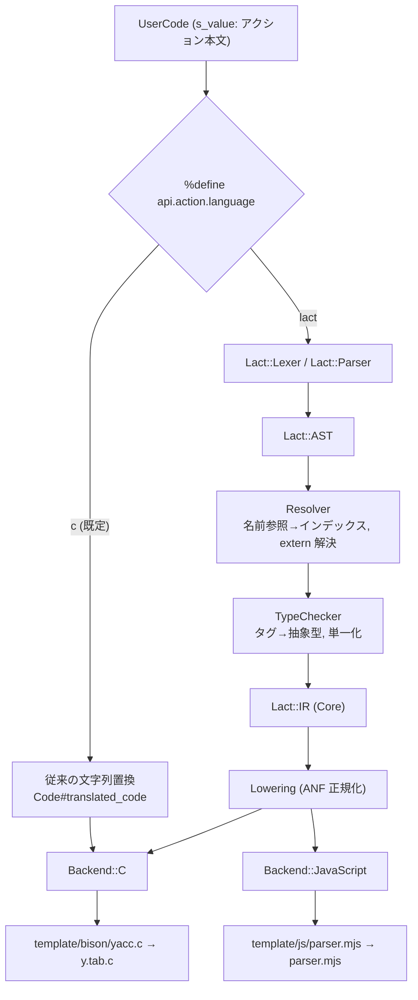

| 項目 | 内容 |
| --- | --- |
| 対象リポジトリ | [ruby/lrama](https://github.com/ruby/lrama) |
| 調査時点のバージョン | Lrama 0.8.0 (`lib/lrama/version.rb`) |
| 目的 | セマンティックアクションを宿主言語非依存の抽象言語で記述し、C / JavaScript へ変換する機能の設計 |
| 言語仮称 | **Lact** (Lrama ACTion language) |

Lrama に型付きの抽象アクション言語 **Lact** を導入する。利用は文法ごとに選択する。

## 提案

- `%define api.action.language lact` を指定した文法では、アクション本文を Lact として解析する。
- Lact を AST、型検査、言語非依存 IR の順に変換し、C と JavaScript の薄いバックエンドからコードを生成する。
- 既存の生 C アクションは変更せず、Lact 文法内でも `%raw` を使って対象言語固有コードへ段階的に退避できるようにする。
- v1 は C と JavaScript を対象とし、既存文法の出力互換性と両バックエンドの差分テストを受け入れ条件にする。

## 判断理由

現在の Lrama はアクション本文を C として構文解析せず、`$$` や `$n` などの参照だけを文字列置換している。Lact はこの抽象化点の後段に解析・検査・コード生成を追加するため、従来経路を維持できる。制御構造と評価順序は共通 IR で解決し、バックエンドはレンダリングだけを担う。これにより、対象言語を追加するときの実装差分を抑える。

## 影響範囲

主な変更対象は、Lrama のアクション処理、文法ディレクティブ、出力バックエンド、JavaScript 用スケルトンである。Lact を指定しない既存文法、既存 C スケルトン、字句解析器の生成は変更しない。`ruby/ruby` の `parse.y` 全面移行と汎用プログラミング言語化は対象外とする。

## この文書の読み方

| 読者 | 最初に確認する節 |
| --- | --- |
| 提案をレビューする人 | 背景と課題、ゴールと非ゴール、全体設計、リスクと代替案、未解決事項 |
| 実装する人 | 現状アーキテクチャ、Lact の仕様、中間表現、バックエンド設計、Lrama への統合、テスト戦略 |
| 移行を検討する人 | サンプル、段階的な導入計画、主要リスク |

## 1. 背景と課題

Lrama は Ruby の `parse.y` をビルドするための LALR パーサジェネレータであり、現状は **C 専用**である。

- 出力スケルトンは `template/bison/yacc.c` / `yacc.h` / `_yacc.h` の 3 ファイルのみ
- `Options#skeleton` のデフォルトは `"bison/yacc.c"`
- セマンティックアクション `{ ... }` は **生の C コード文字列** として扱われる

他言語のパーサを生成しようとすると、2 つの独立した課題が現れる。

| 課題 | 内容 | 難易度 |
| --- | --- | --- |
| (A) スケルトンの多言語化 | `yyparse` の駆動ループ・状態表を対象言語で書く | 中（テンプレート追加で解決可能） |
| (B) **アクションの多言語化** | 利用者が書いた `{ $$ = $1 + $3; }` を対象言語へ変換する | 高（本質的に未解決） |

本設計書は **(B) を主題**とし、(A) は (B) を実証するために必要な範囲で扱う。

### 1.1 想定ユースケース

1. **同一文法からの複数言語パーサ生成** — 1 つの `.y` から C 版と JavaScript（以下、JS）版を生成し、ブラウザ／Node 上で同じ構文解析を行う
2. **Ruby 文法の Web 移植** — シンタックスハイライタ、Web IDE、LSP、Playground
3. **文法のテスト容易性** — C をビルドせずに JS（あるいは将来 Ruby）でアクションの挙動を検証する
4. **文法仕様の形式化** — アクションが型付きの小さな言語で書かれることで、静的検査・ドキュメント生成・可視化が可能になる

---

## 2. ゴールと非ゴール

### 2.1 ゴール

| ID | 内容 |
| --- | --- |
| G1 | アクションを宿主言語に依存しない小さな言語 (Lact) で記述できる |
| G2 | 同一の Lact アクションから C と JavaScript を生成できる |
| G3 | 既存の生 C アクションと**同一文法ファイル内で共存**できる（段階移行が可能） |
| G4 | バックエンドの追加コストが小さい（Rust / Java / Ruby を後から足せる） |
| G5 | 生成コードが人間に読め、元の `.y` の行にマップされる（`#line` / source map） |
| G6 | Lact を使わない既存文法に対して**挙動・出力バイト列が一切変化しない** |

### 2.2 非ゴール

| ID | 内容 | 理由 |
| --- | --- | --- |
| N1 | 汎用プログラミング言語を作らない | アクションに必要な表現力に絞る。複雑な処理は外部関数に追い出す |
| N2 | prologue / epilogue (`%{ %}`, `%code`, `%union`) の変換 | ここは言語ごとに書き分ける前提。変換は割に合わない |
| N3 | 字句解析器の生成 | Lrama のスコープ外 |
| N4 | `ruby/ruby` の `parse.y` 全面移行 | 現実的でない（§14.1）。新規文法・小中規模文法が当面のターゲット |
| N5 | ランタイムライブラリの提供 | 生成物は依存ゼロの単一ファイルを維持する |

---

## 3. 現状アーキテクチャの分析

### 3.1 全体パイプライン

```
.y ファイル
  │
  ├─ Lrama::Lexer            … トークン化。アクションは lex_c_code で「丸ごと文字列」として切り出す
  ├─ Lrama::Parser           … parser.y (Racc) から生成。Grammar を組み立てる
  ├─ Lrama::Grammar          … 記号・規則・型・%define 等の保持と検証 (#prepare, #validate!)
  ├─ Lrama::States           … LALR 状態計算
  ├─ Lrama::Context          … yytable / yycheck 等の数表生成
  └─ Lrama::Output           … ERB で template/bison/yacc.c を評価して出力
```

### 3.2 アクションが C になるまで

`{ $$ = $1 + $3; }` が `(yyval.val) = (yyvsp[-2].val) + (yyvsp[0].val);` になる経路は以下の通り。

```
Lexer#lex_c_code
  └─> Lexer::Token::UserCode(s_value: "$$ = $1 + $3;", location: ...)
        │  ※ 中括弧の対応を数えているだけで、C としてのパースは一切していない
        │
        └─> UserCode#references            (lib/lrama/lexer/token/user_code.rb)
              │  正規表現で $$, $n, $name, $[name], @$, @n, $:n を走査し
              │  Grammar::Reference(type:, name:, number:, index:, ex_tag:,
              │                     first_column:, last_column:) の配列を返す
              │
              └─> Grammar::Code#translated_code   (lib/lrama/grammar/code.rb)
                    │  references を「後ろから」文字列置換していくだけ
                    │
                    └─> Grammar::Code::RuleAction#reference_to_c
                          $$ → (yyval.<tag>)
                          $n → (yyvsp[i].<tag>)      i = -position_in_rhs + ref.index
                          @$ → (yyloc)
                          @n → (yylsp[i])
                          $:n → (i - 1)
                          │
                          └─> Output#user_actions が
                                case <rule_id+1>: /* comment */
                                #line <行> "<grammar file>"
                                    { <translated_code> }
                                #line [@oline@] [@ofile@]
                                    break;
                              を組み立て、yacc.c の yyreduce に埋め込む
```

`Code` のサブクラスは用途ごとに参照の可否を切り替えている。

| クラス | 用途 | `$$` | `$n` | `@$` | `@n` |
| --- | --- | --- | --- | --- | --- |
| `Code::RuleAction` | 規則アクション | `(yyval.tag)` | `(yyvsp[i].tag)` | `(yyloc)` | `(yylsp[i])` |
| `Code::PrinterCode` | `%printer` | `((*yyvaluep).tag)` | エラー | `(*yylocationp)` | エラー |
| `Code::DestructorCode` | `%destructor` | 同上 | エラー | 同上 | エラー |
| `Code::InitialActionCode` | `%initial-action` | `(yylval)` 相当 | エラー | `(yylloc)` 相当 | エラー |
| `Code::NoReferenceCode` | `%union` / `%parse-param` 等 | 全てエラー | | | |

### 3.3 設計の前提

この調査から、設計の土台となる 4 つの事実が得られる。

1. アクション本文は構文解析されず、文字列として置換される。抽象言語のパーサを後段に追加すれば、既存経路を維持できる。
2. C 依存の変換は、1つのメソッド `reference_to_c` が全て担う。この処理をバックエンドへ委譲すれば、`$n` からスタックオフセットを求める言語非依存の計算と、言語依存のレンダリングを分離できる。
3. 型情報の唯一の源はタグ（`%union` のメンバ名）である。`%type <val> expr` の `val` が `$$` / `$n` の型を決めるため、Lact の型システムもこれを基盤にする。
4. パラメータ化規則は `Reference` オブジェクトを直接書き換える。`Grammar::Parameterized::Rhs#resolve_user_code` は `references` の `name` を変更して `$x` から `$expr` への参照を解決する。Lact フロントエンドも同じ `Reference` オブジェクトを共有する必要がある（§8.4）。

---

## 4. 全体設計

### 4.1 新しいパイプライン



### 4.2 レイヤの責務

| レイヤ | 責務 | 言語依存 |
| --- | --- | --- |
| Frontend (Lexer/Parser) | Lact のテキスト → AST | 非依存 |
| Resolver | `$name` → 位置番号、`$n` → スタックオフセット、extern 名解決 | 非依存 |
| TypeChecker | タグ・`%value-type`・`%extern` の型から検査と推論 | 非依存 |
| Lowering | 糖衣の除去、式の A 正規形化、一時変数の割当 | 非依存 |
| Backend | IR → 対象言語のテキスト | **依存** |
| Skeleton (ERB) | パーサ駆動ループと状態表 | **依存** |

制御構造の平坦化（`if` 式 → 一時変数 + `if` 文）と一時変数の命名は Lowering で行う。バックエンドは、IR ノードごとに 1 行の文字列を返す訪問者に限定する。これにより G4（バックエンド追加の低コスト化）を実現する。

---

## 5. 抽象アクション言語 Lact の仕様

### 5.1 設計原則

| # | 原則 | 根拠 |
| --- | --- | --- |
| P1 | **式指向・不変** — ループなし、再代入なし、`let` 束縛のみ | 変換先の言語差（宣言位置・スコープ規則）を吸収しやすい |
| P2 | **副作用は宣言された外部関数経由のみ** | C のマクロ / JS のクラスといった宿主固有物を 1 箇所に閉じ込める |
| P3 | **型はタグ由来** | 既存の `%union` / `%type` 資産をそのまま活かす |
| P4 | **構文は最小・見慣れた形** | C / JS / Ruby いずれの利用者にも読める |
| P5 | **必ず逃げ道を用意する** (`%raw`) | 表現力不足で行き止まりにしない。段階移行の生命線 |

### 5.2 構文 (EBNF)

```text
action      ::= stmt* expr?                     (* 最後の式の値が $$ になる *)

stmt        ::= "let" ident (":" type)? "=" expr ";"
              | expr ";"
              | lhs "=" expr ";"

lhs         ::= "$$" | "$" ident | "@$"

expr        ::= if_expr | or_expr
if_expr     ::= "if" expr block ("else" (block | if_expr))?
block       ::= "{" stmt* expr? "}"

or_expr     ::= and_expr ("||" and_expr)*
and_expr    ::= cmp_expr ("&&" cmp_expr)*
cmp_expr    ::= add_expr (("==" | "!=" | "<" | "<=" | ">" | ">=") add_expr)?
add_expr    ::= mul_expr (("+" | "-") mul_expr)*
mul_expr    ::= unary   (("*" | "/" | "%") unary)*
unary       ::= ("-" | "!") unary | postfix
postfix     ::= primary ("." ident)*
primary     ::= literal
              | reference
              | ident "(" (expr ("," expr)*)? ")"     (* extern 呼び出し *)
              | ident                                  (* let 束縛変数 *)
              | "(" expr ")"
              | block
              | raw_block

reference   ::= "$" ("$" | number | ident | "[" ident "]")
              | "@" ("$" | number | ident | "[" ident "]")
              | "$:" (number | ident | "[" ident "]")
              | "$<" tag ">" ("$" | number | ident)    (* 明示タグ付き参照 *)

raw_block   ::= "%raw" ident ("<" type ">")? "{" ... "}"

literal     ::= number | float | string | "true" | "false" | "nil" | "()"
type        ::= "int" | "float" | "bool" | "str" | "unit" | "loc" | ident
```

予約語: `let`, `if`, `else`, `true`, `false`, `nil`, `int`, `float`, `bool`, `str`, `unit`, `loc`, `%raw`

### 5.3 意味論

#### 5.3.1 文法参照

| 記法 | 意味 | 型 |
| --- | --- | --- |
| `$$` | 左辺の値（書き込み対象、読み出しも可） | LHS のタグに対応する型 |
| `$n` | RHS の n 番目の値 | `rhs[n-1]` のタグに対応する型 |
| `$name` / `$[name]` | 名前付き参照 | 同上 |
| `$<tag>n` | タグを明示した参照 | `tag` に対応する型 |
| `@$` / `@n` | 位置情報 | 組み込み型 `loc` |
| `$:n` | RHS n 番目のスタックインデックス | `int` |

`$$` への代入は**明示・暗黙の両方**を許す。

```c
/* 明示 */  { $$ = $1 + $3; }
/* 暗黙 */  { $1 + $3 }
```

暗黙形は Lowering で `Assign(LhsRef, expr)` に正規化されるため、以降は区別されない。
アクションの最後の式が `unit` 型の場合は `$$` への代入を行わない（Bison の既定動作 `$$ = $1` を維持するかは §15 の未解決事項）。

#### 5.3.2 組み込み型 `loc`

`loc` は 4 つの `int` フィールドを持つレコードとして扱う。

```
@$.first_line   @$.first_column   @$.last_line   @$.last_column
```

| バックエンド | 表現 |
| --- | --- |
| C | `YYLTYPE` 構造体。`@$.first_line` → `(yyloc).first_line` |
| JS | `{first_line, first_column, last_line, last_column}` のプレーンオブジェクト |

`loc` の生成は行わない（スケルトンが `YYLLOC_DEFAULT` 相当で自動計算する）。外部関数へ渡す用途のみ。

#### 5.3.3 演算子

| 種別 | 演算子 | 適用型 | 結果型 |
| --- | --- | --- | --- |
| 算術 | `+ - * / %` | `int`, `float`（混在不可） | 同型 |
| 単項 | `-` | `int`, `float` | 同型 |
| 比較 | `== != < <= > >=` | `int`, `float` | `bool` |
| 等値 | `== !=` | `bool`, 抽象型（同一型どうし） | `bool` |
| 論理 | `&& \|\| !` | `bool` | `bool`（短絡評価） |

`str` に対する `+`（連結）や `==`（比較）は **v1 では提供しない**。C では `strcmp` / アロケーションを伴い、メモリ管理方針を Lact が決めてしまうため。必要なら `%extern` で宣言する。

#### 5.3.4 評価順序

引数・オペランドは**左から右**に評価される。C の未定義な評価順序に依存しないよう、Lowering で全ての部分式を一時変数に束ね（A 正規形化）、順序を明示的に固定する。これは C / JS 間で挙動を一致させるための必須処理である。

### 5.4 型システム

#### 5.4.1 型の種類

```
基本型   : int | float | bool | str | unit | loc
抽象型   : %extern-type で宣言された名前 (Node, Value, ...)
```

型変数・多相・ジェネリクスは v1 では導入しない（アクションでの必要性が薄く、実装コストが高いため）。

#### 5.4.2 タグと抽象型の対応

`%union` のメンバ名（タグ）と Lact の型を結びつける宣言を追加する。

```text
%union {
    int   val;
    NODE *node;
}

%value-type <val>  int
%value-type <node> Node
```

`%value-type` が未宣言のタグを持つ記号を Lact アクションから参照した場合は**エラー**とする（型が決まらないため）。
`%union` 自体を `%value-type` 宣言から自動生成する案は §15 の未解決事項。

#### 5.4.3 検査規則（抜粋）

| 対象 | 規則 |
| --- | --- |
| `$$ = e` | `typeof(e)` が LHS タグの型と一致 |
| `$n` | `rhs[n-1]` にタグがない場合はエラー（`%empty` / 中間規則は §15） |
| `f(a₁..aₙ)` | `f` の宣言引数型と一致。引数個数一致 |
| `if c { a } else { b }` | `typeof(c) == bool`、`typeof(a) == typeof(b)` |
| `if c { a }`（else なし） | `typeof(a) == unit` |
| `let x = e` | `x` の型は `typeof(e)`。注釈があれば一致検査 |
| `nil` | 文脈から抽象型が決まること。決まらなければエラー |
| ブロック末尾 | 値を持たない文で終わる場合は `unit` |

型推論は**局所的**（双方向型検査）に留める。`let` の型注釈は省略可能だが、`nil` のように文脈依存の値は注釈が必要になる場合がある。

### 5.5 外部インターフェース

#### 5.5.1 `%extern-type` — 抽象型の宣言

```text
%extern-type Node {
  %backend c  { type: "NODE *", nil: "NULL" }
  %backend js { type: "Node",   nil: "null" }
}
```

| キー | 必須 | 意味 |
| --- | --- | --- |
| `type` | ✓ | 宿主言語での型表記。C では変数宣言に使う。JS では型検査には使わず、JSDoc / TypeScript 宣言出力にのみ使用 |
| `nil` | — | `nil` リテラルの表現。未指定でその型に `nil` を使うとエラー |

#### 5.5.2 `%extern` — 外部関数の宣言

```text
%extern binop : (str, Node, Node, loc) -> Node {
  %backend c  { NEW_BINOP($1, $2, $3, &$4) }
  %backend js { new BinOp($1, $2, $3, $4) }
}

%extern warn : (str, loc) -> unit {
  %backend c  { rb_warn_at($1, &$2) }
  %backend js { ctx.warn($1, $2) }
}
```

- 本体は**式テンプレート**。`$1`..`$n` が実引数に置き換わる（アクション本文の `$n` とは別空間）
- 戻り値型が `unit` の場合は文として出力される
- 実引数は Lowering によって一時変数に束縛済みなので、テンプレート内で `$1` が複数回現れても**多重評価されない**（C マクロの典型的な罠を構造的に回避）
- あるバックエンドの実装が欠けている `%extern` をそのバックエンドの生成時に参照した場合、**生成時エラー**にする（実行時に落ちるより早く気づける）

#### 5.5.3 `%raw` — エスケープハッチ

```c
list : list item {
         %raw c  { $$ = NEW_LIST_APPEND($1, $2); }
         %raw js { $$ = [...$1, $2]; }
       }
     ;
```

- **文形式** `%raw <backend> { ... }` は `unit` 型
- **式形式** `%raw <backend><T> { ... }` は型 `T` の式
- `%raw` の中身は**そのバックエンドの生コード**であり、`$$` / `$n` / `@n` の置換のみ行われる（＝従来の C アクションと同じ扱い）
- 現在のバックエンドに対応する `%raw` が 1 つも無く、他に値を決める式も無いアクションは**生成時エラー**

これにより「まず全アクションを `%raw c` で囲んで移行し、少しずつ Lact 化する」という現実的な移行パスが取れる。

### 5.6 `.y` ファイルへの埋め込み

Lact のアクションブロックは、既存の C アクションと同じ `{ ... }` を使う。

```text
%define api.action.language lact
```

このグローバル宣言によって、`{ ... }` の解釈が C から Lact に切り替わる。

`Lexer#lex_c_code` は中括弧の対応数と文字列リテラル `"..."` / `'...'` だけを確認する。そのため、Lact のソースも本文文字列として切り出せ、字句解析器の変更はほぼ不要である。

Lact のコメント記法には `//` と `/* */` を採用して C と揃える。また、ブロック内の `%raw` を `lex_c_code` が素通しすることを確認する。

将来、アクション単位での切り替えが必要になった場合は、前置マーカ（例: `%lact{ ... }` / `%c{ ... }`）を追加できるが、v1 ではグローバル切り替え + `%raw` で十分と判断する。

### 5.7 新設ディレクティブ一覧

| ディレクティブ | 用途 |
| --- | --- |
| `%define api.action.language {c\|lact}` | アクション記述言語の選択（既定 `c`） |
| `%value-type <tag> TYPE` | タグ ↔ 抽象型の対応 |
| `%extern-type NAME { %backend ... }` | 抽象型の宿主表現 |
| `%extern NAME : SIG { %backend ... }` | 外部関数 |
| `%define api.js.module {esm\|cjs}` | JS 出力のモジュール形式（既定 `esm`） |

`Lexer::PERCENT_TOKENS` に `%value-type`, `%extern-type`, `%extern`, `%backend` を追加し、`parser.y` に規則を足す。

---

## 6. 中間表現 (Lact::IR)

### 6.1 なぜ AST と IR を分けるか

AST には糖衣（暗黙の `$$`、中置演算子、名前付き参照、`if` 式、ネストした部分式）が残る。これらをバックエンドごとに解釈させると、バックエンドを 1 つ足すたびに同じ苦労を繰り返すことになる。IR ではこれらを取り除き、**バックエンドが「1 ノード = 1 行」で書ける形**まで落とす。

### 6.2 IR ノード

| ノード | フィールド | 意味 |
| --- | --- | --- |
| `Const` | `value`, `type` | リテラル |
| `Nil` | `type` | 抽象型の空値 |
| `StackRead` | `offset`, `tag`, `type` | `$n` |
| `StackWrite` | `tag`, `type`, `value` | `$$ = e` |
| `LocRead` | `offset` (nil なら `@$`) | `@$` / `@n` |
| `IndexRead` | `offset` | `$:n` |
| `Local` | `name`, `type` | 一時変数・`let` 変数の参照 |
| `LetStmt` | `name`, `type`, `value` | 局所束縛（値は既に平坦） |
| `IfStmt` | `cond`, `then_stmts`, `else_stmts` | 条件分岐（式ではなく**文**） |
| `BinOp` | `op`, `lhs`, `rhs`, `type` | 二項演算（オペランドは `Local`/`Const` のみ） |
| `UnOp` | `op`, `operand`, `type` | 単項演算 |
| `CallExtern` | `extern`, `args`, `type` | 外部関数呼び出し |
| `FieldGet` | `receiver`, `field`, `type` | `@1.first_line` |
| `Raw` | `backend`, `text`, `type`, `references` | `%raw` |
| `ExprStmt` | `expr` | 値を捨てる文 |

### 6.3 Lowering（A 正規形化）が行うこと

| 入力 (AST) | 出力 (IR) |
| --- | --- |
| `$$ = f($1 + 1, $3)` | `LetStmt(t0, BinOp(+, StackRead(-2), Const(1)))` → `LetStmt(t1, CallExtern(f, [t0, StackRead(0)]))` → `StackWrite(t1)` |
| `$$ = if c { a } else { b }` | `LetStmt(t0, undef)` → `IfStmt(c, [Assign(t0,a)], [Assign(t0,b)])` → `StackWrite(t0)` |
| `a && b` | `LetStmt(t0, false)` → `IfStmt(a, [Assign(t0, b)], [])`（短絡の明示化） |

一時変数名は `yylact_0`, `yylact_1`, ... とする（`yy` 接頭辞は Bison 系で予約されており、利用者のコードとの衝突リスクが最小）。

**この段階で「オフセット計算」は完了している**点が重要である。`offset = -position_in_rhs + ref.index` は言語非依存なので、C も JS も同じ整数を受け取り、レンダリング方法だけが異なる。

---

## 7. バックエンド設計

### 7.1 共通インターフェース

```ruby
module Lrama
  module Backend
    class Base
      # 識別子。%raw / %backend のキーに使う
      def name; raise NotImplementedError; end

      # --- 参照のレンダリング（Phase 0 の抽象化点） ---
      def lhs_value(tag);            end   # $$
      def rhs_value(offset, tag);    end   # $n
      def lhs_location;              end   # @$
      def rhs_location(offset);      end   # @n
      def rhs_index(offset);         end   # $:n

      # --- 型 ---
      def type_name(abstract_type);  end   # 変数宣言用
      def nil_literal(abstract_type);end

      # --- 文の出力（IR は Lowering 済みなので平坦） ---
      def emit_stmts(stmts, indent:); end

      # --- スケルトン側で必要な補助 ---
      def int_array_literal(ary);    end
      def comment(text);             end
      def line_directive(line, file);end
    end
  end
end
```

`Grammar::Code#translated_code` は `translated_code(backend)` に一般化し、既存の `reference_to_c` は `Backend::C` へ移設する。

### 7.2 C バックエンド

**現行出力との完全互換を最優先**する。既存の変換規則をそのまま踏襲することで、Lact を使わない文法の出力が 1 バイトも変わらないことを保証する。

| 参照 | 出力 |
| --- | --- |
| `$$` (tag=`val`) | `(yyval.val)` |
| `$$` (`%union` 未定義) | `(yyval)` |
| `$n` | `(yyvsp[offset].val)` |
| `@$` / `@n` | `(yyloc)` / `(yylsp[offset])` |
| `$:n` | `(offset - 1)` |

Lact 特有の出力方針:

| 項目 | 方針 |
| --- | --- |
| 一時変数 | ブロック先頭で宣言（C89 互換）。`int yylact_0;` |
| `if` | 文として出力。式が必要な箇所は Lowering が一時変数化済み |
| 短絡評価 | Lowering で `if` 文に展開済みなので `&&` は使わない（評価順序が保証される） |
| `int` 除算 | `/` をそのまま出力（C の切り捨て意味論が基準） |
| ブロック | `{ ... }` で包み、変数スコープを閉じる |
| `#line` | 従来どおりアクション先頭に 1 回のみ（複数行展開の途中行は元ソースに対応しないが、現状と同等の精度） |

### 7.3 JavaScript バックエンド

#### 7.3.1 値スタックの設計

**C のスタック構造を意図的に模倣する。** 状態スタック `yyss` / 値スタック `yyvs` / 位置スタック `yyls` を配列とし、`yyssp` / `yyvsp` / `yylsp` を**整数インデックス**として保持する。

| 参照 | C | JavaScript |
| --- | --- | --- |
| `$$` | `(yyval.val)` | `yyval` |
| `$n` | `(yyvsp[-2].val)` | `yyvs[yyvsp - 2]` |
| `@$` | `(yyloc)` | `yyloc` |
| `@n` | `(yylsp[-2])` | `yyls[yylsp - 2]` |
| `$:n` | `(-2 - 1)` | `(-2 - 1)` |

この設計により、**オフセット計算のロジックが両バックエンドで完全に共有できる**。タグ (`.val`) は JS では単純に無視される（型の安全性は Lact の型検査が担保するため、実行時に union のメンバを区別する必要がない）。

#### 7.3.2 意味論のギャップと対処

C と JS で挙動が異なる箇所は、**JS バックエンド側で C の意味論に合わせる**方針を採る（C が既存資産の基準であるため）。

| 項目 | C | JS 素の挙動 | JS バックエンドの出力 |
| --- | --- | --- | --- |
| `int` 同士の `/` | 0 方向切り捨て | 浮動小数 | `Math.trunc(a / b)` |
| `int` の `%` | 0 方向切り捨て | 同じ | `a % b`（そのまま） |
| 等値比較 | `==` | `==` は型変換を行う | 常に `===` / `!==` |
| `int` オーバーフロー | 32bit ラップ（厳密には UB） | 倍精度で継続 | **v1 では合わせない**（§15 で議論） |
| `bool` | `int` の 0/非 0 | `boolean` | `true`/`false` を出力。条件式には必ず `bool` 型を要求 |

`int` のオーバーフロー挙動を一致させるには全演算に `| 0` を挟む必要があり、可読性と性能を大きく損なう。v1 では**「値が 32bit に収まる範囲では C と一致する」**ことを保証範囲とし、ドキュメントに明記する。厳密一致が必要な文法向けに `%define api.int.wrap true` を将来オプションとして検討する。

#### 7.3.3 その他の方針

| 項目 | 方針 |
| --- | --- |
| 変数宣言 | `let`（再代入される一時変数）と `const`（`let` 束縛）を使い分ける |
| モジュール | 既定 ESM。`%define api.js.module cjs` で CommonJS |
| `%union` | 完全に無視。警告も出さない（C 用の宣言として正当なため） |
| `%destructor` | 無視（GC があるため）。ただし `-W` 指定時に情報メッセージ |
| `%printer` | デバッグトレース (`YYDEBUG` 相当) でのみ使用 |
| `%parse-param` | C 宣言からは型を取り出せないため、`%define api.js.parse_param "ctx"` で名前のみ指定（§15） |
| エラー報告 | `yyerror` の代わりに呼び出し側から渡すハンドラ `ctx.error(loc, msg)` |
| 位置情報 | `{first_line, first_column, last_line, last_column}` |

### 7.4 JS スケルトンの設計

`template/js/parser.mjs` を新設する。方針は **`yacc.c` の構造を機械的に写し取る**こと。独自実装にすると、C 版とのバグの非対称性が生まれ、レビューもできなくなる。

最大の実装上の論点は **JS に `goto` が無い**ことである。`yacc.c` は `yynewstate` / `yybackup` / `yydefault` / `yyreduce` / `yyerrlab` / `yyerrorlab` / `yyerrlab1` / `yyacceptlab` / `yyabortlab` / `yyreturnlab` へのラベルジャンプで駆動される。これを**明示的な状態機械**に置き換える。

```js
const NEWSTATE = 0, BACKUP = 1, DEFAULT = 2, REDUCE = 3,
      ERRLAB = 4, ERRORLAB = 5, ERRLAB1 = 6, ACCEPT = 7, ABORT = 8;

let phase = NEWSTATE;
for (;;) {
  switch (phase) {
    case NEWSTATE: /* ... */ phase = BACKUP;  continue;
    case BACKUP:   /* ... */ phase = DEFAULT; continue;
    case REDUCE:
      yyval = yyvs[yyvsp + 1 - yylen];
      switch (yyn) {
        // ここに user_actions が展開される
      }
      /* ... */
      phase = NEWSTATE; continue;
    /* ... */
    case ACCEPT: return { ok: true,  value: yyval };
    case ABORT:  return { ok: false, value: undefined };
  }
}
```

ラベル名と `phase` 定数を 1:1 対応させることで、`yacc.c` との差分レビューが可能な状態を保つ。

数表の出力は `Output#int_array_to_string` の JS 版が必要になる。

```js
const yytable = [
     4,   5,   6,  22,   7,   8, ...
];
```

型付き配列 (`Int16Array`) はメモリ効率が良いが、生成物の可読性とデバッグ性を優先して**通常配列**を既定とする（V8 の SMI 配列最適化が効くため実性能差は小さい）。

### 7.5 `Output` クラスの整理

現在の `Lrama::Output` は C 依存のメソッド（`int_type_for`, `symbol_actions_for_printer`, `parse_param_use`, `b4_cpp_guard__b4_spec_mapped_header_file` など）を多数持つ。これらを一気に整理するのはリスクが高いため、以下の段階を踏む。

1. `Output` に `backend` を注入する（既定は `Backend::C`）
2. C 依存メソッドは `Output` に残したまま、内部で `backend` に委譲する形に置き換える
3. JS スケルトンは `Output` の**新設メソッドのみ**を使う（既存メソッドを JS 用に条件分岐させない）
4. 十分に安定してから `Output::C` / `Output::JavaScript` へのサブクラス分離を検討する

---

## 8. Lrama への統合

### 8.1 新規ファイル

```
lib/lrama/action_language/
  lexer.rb                 # Lact の字句解析
  parser.rb                # 再帰下降 + Pratt パーサ（式）
  ast.rb, ast/*.rb         # AST ノード
  resolver.rb              # 参照解決・extern 解決
  type_checker.rb          # 型検査
  types.rb                 # 型表現
  extern.rb                # %extern / %extern-type の保持
  ir.rb, ir/*.rb           # IR ノード
  lowering.rb              # ANF 化・一時変数割当
  errors.rb                # 診断
lib/lrama/backend.rb
lib/lrama/backend/base.rb
lib/lrama/backend/c.rb
lib/lrama/backend/javascript.rb
template/js/parser.mjs
```

Lact のパーサには手書きを推奨する。Lrama 自身は `parser.y` を Racc でビルドしているが、Lact は (1) 文法が小さい、(2) エラーメッセージの品質が重要、(3) ビルド依存を増やしたくない、という条件がある。式部分は Pratt パーシングで 100 行程度に収まる。

### 8.2 既存ファイルの変更点

| ファイル | 変更内容 | 規模 |
| --- | --- | --- |
| `lib/lrama/lexer.rb` | `PERCENT_TOKENS` に 4 語追加。`lex_c_code` は**変更なし** | 小 |
| `parser.y` | `%value-type` / `%extern-type` / `%extern` の規則追加 | 小 |
| `lib/lrama/grammar.rb` | `externs`, `extern_types`, `value_types` の保持と検証 | 中 |
| `lib/lrama/grammar/code.rb` | `translated_code` → `translated_code(backend)` | 小 |
| `lib/lrama/grammar/code/*.rb` | `reference_to_c` → `reference_to(backend)` へリネーム | 中 |
| `lib/lrama/grammar/rule.rb` | `translated_code(grammar)` → `translated_code(grammar, backend)` | 小 |
| `lib/lrama/output.rb` | `backend` の注入、JS 用補助メソッドの追加 | 中 |
| `lib/lrama/options.rb` | `action_language` は `%define` 経由なので追加不要 | — |
| `lib/lrama/command.rb` | skeleton 名からバックエンドを決定して `Output` に渡す | 小 |

### 8.3 CLI

既存の `-S/--skeleton` をそのまま使う。拡張子からの推測は行わない（明示性を優先）。

```console
# C（従来どおり、既定）
$ lrama -d calc.y -o calc.c

# JavaScript
$ lrama -S js/parser.mjs -o calc.mjs calc.y
```

バックエンドはスケルトンのディレクトリ名（`bison/` → C、`js/` → JavaScript）から決定する。将来的に `--language=js` を追加してもよい。

### 8.4 互換性上の注意点（実装者向け）

#### (1) パラメータ化規則との相互作用

`Grammar::Parameterized::Rhs#resolve_user_code` は、`UserCode#references` が返す `Reference` オブジェクトの `name` を**破壊的に書き換える**ことで `%rule` / `%inline` の仮引数を解決している。

```ruby
var_to_arg.each do |var, arg|
  resolved.references.each do |ref|
    if ref.name == var
      ref.name = arg          # ← ここ
    end
  end
end
```

したがって Lact フロントエンドは、次の 2 条件を満たさなければならない。

- **Lact の AST は `Grammar::Reference` インスタンスを保持し、`UserCode#references` はそれと同一のオブジェクトを返す**
- **Lact のパース（および参照解決）は遅延実行**であり、`resolve_user_code` による書き換えの後に走る

これを満たさないと、`%rule` / `%inline` を使った文法で Lact アクションの参照解決が静かに壊れる。Phase 1 のテストでこの条件を検証する。

#### (2) 中間規則アクション (midrule action)

`Code::RuleAction#position_in_rhs` は中間規則アクションのために `@rule.position_in_original_rule_rhs` を参照している。Lact でもこの計算をそのまま使う（オフセット計算は言語非依存なので変更不要）。ただし中間規則アクションの `$$` の型はタグが無いと決まらない（§15）。

#### (3) `%define` の値の型

`Grammar#define` は `Hash[String, String]`。`api.action.language` の値は `parser.y` の `variable value` 規則で受け取れる。

---

## 9. サンプル

### 9.1 電卓 (before / after)

**before（現行の C アクション）**

```text
%union { int val; }
%token <val> NUM
%type  <val> expr
%left '+' '-'
%left '*' '/'
%locations

%%
expr : NUM
     | expr '+' expr { $$ = $1 + $3; }
     | expr '/' expr {
         if ($3 == 0) { yyerror(&@$, "division by zero"); $$ = 0; }
         else { $$ = $1 / $3; }
       }
     | '(' expr ')'  { $$ = $2; }
     ;
```

**after（Lact）**

```text
%define api.action.language lact

%union { int val; }
%value-type <val> int

%extern err : (str, loc) -> unit {
  %backend c  { yyerror(&$2, $1) }
  %backend js { ctx.error($2, $1) }
}

%token <val> NUM
%type  <val> expr
%left '+' '-'
%left '*' '/'
%locations

%%
expr : NUM
     | expr '+' expr { $1 + $3 }
     | expr '/' expr {
         if $3 == 0 {
           err("division by zero", @$);
           0
         } else {
           $1 / $3
         }
       }
     | '(' expr ')'  { $2 }
     ;
```

### 9.2 生成される C

```c
  case 3: /* expr: expr '/' expr  */
#line 22 "calc.y"
    {
      int yylact_0;
      if ((yyvsp[0].val) == 0)
        {
          yyerror (&(yyloc), "division by zero");
          yylact_0 = 0;
        }
      else
        {
          yylact_0 = (yyvsp[-2].val) / (yyvsp[0].val);
        }
      (yyval.val) = yylact_0;
    }
#line 1183 "calc.c"
    break;
```

### 9.3 生成される JavaScript

```js
      case 3: /* expr: expr '/' expr  */
      // calc.y:22
      {
        let yylact_0;
        if (yyvs[yyvsp + 0] === 0) {
          ctx.error(yyloc, "division by zero");
          yylact_0 = 0;
        } else {
          yylact_0 = Math.trunc(yyvs[yyvsp - 2] / yyvs[yyvsp + 0]);
        }
        yyval = yylact_0;
      }
        break;
```

### 9.4 AST を構築する例

```text
%extern-type Node {
  %backend c  { type: "NODE *", nil: "NULL" }
  %backend js { type: "Node",   nil: "null" }
}

%extern binop : (str, Node, Node, loc) -> Node {
  %backend c  { NEW_BINOP($1, $2, $3, &$4) }
  %backend js { { kind: "binop", op: $1, lhs: $2, rhs: $3, loc: $4 } }
}

%extern num : (int, loc) -> Node {
  %backend c  { NEW_LIT($1, &$2) }
  %backend js { { kind: "num", value: $1, loc: $2 } }
}

%union { int ival; NODE *node; }
%value-type <ival> int
%value-type <node> Node

%token <ival> NUM
%type  <node> expr

%%
expr : NUM              { num($1, @1) }
     | expr '+' expr    { binop("+", $1, $3, @$) }
     | expr '*' expr    { binop("*", $1, $3, @$) }
     ;
```

同じ文法から C 側は `NEW_BINOP` マクロを呼び、JS 側はプレーンオブジェクトを組み立てる。**アクション本体は 1 つだけ**である。

---

## 10. 段階的な導入計画

各フェーズは単独でマージ可能・単独で価値があるように切る。

### Phase 0 — 抽象化のための準備リファクタ

| 項目 | 内容 |
| --- | --- |
| 作業 | `Code#reference_to_c` → `Code#reference_to(backend)` へ。`Backend::Base` / `Backend::C` の新設。`Output` へのバックエンド注入 |
| 成果物 | 挙動不変のリファクタ |
| 受け入れ条件 | 既存の全 spec が green。`sample/*.y` および `ruby/ruby` の `parse.y` の生成結果が**バイト単位で一致** |
| 意義 | 単独でも「C 依存箇所の明確化」という価値がある。レビューしやすい |

### Phase 1 — Lact フロントエンド + C バックエンド

| 項目 | 内容 |
| --- | --- |
| 作業 | Lexer / Parser / AST / Resolver / Lowering / IR。`%define api.action.language lact`。`%raw` |
| スコープ | 型検査なし（この時点ではタグを型として素通し）。`%extern` なし |
| 受け入れ条件 | `sample/calc.y` の Lact 版が C として生成・ビルド・実行でき、既存版と同じ出力を返す。`%rule`/`%inline` との組合せが動く（§8.4-(1)） |

### Phase 2 — 型検査と外部インターフェース

| 項目 | 内容 |
| --- | --- |
| 作業 | `%value-type`, `%extern-type`, `%extern`, TypeChecker、診断メッセージ |
| 受け入れ条件 | 型エラーが `.y` の正しい行・列を指して報告される。§9.4 の例が C で動く |

### Phase 3 — JavaScript バックエンドとスケルトン

| 項目 | 内容 |
| --- | --- |
| 作業 | `Backend::JavaScript`、`template/js/parser.mjs`、`Output` の JS 用補助 |
| 受け入れ条件 | §9 の例が Node で動作し、**C 版と同一入力に対し同一出力**（§11 の差分テスト） |

### Phase 4 — 品質向上

| 項目 | 内容 |
| --- | --- |
| 作業 | source map、エラー回復の対応、`%printer`/`%destructor` の Lact 化、TypeScript 型定義出力、追加バックエンド (Rust など) |

---

## 11. テスト戦略

### 11.1 レイヤ別

| 種別 | 対象 | 場所 |
| --- | --- | --- |
| ユニット | Lact Lexer / Parser / Resolver / TypeChecker / Lowering | `spec/lrama/action_language/` |
| ユニット | 各 Backend の emit | `spec/lrama/backend/` |
| ゴールデン | `.y` → 期待される C / JS のスナップショット | `spec/fixtures/action_language/` |
| 統合 | 生成 → gcc / node でビルド → 実行 | 既存 `spec/lrama/integration_spec.rb` の流儀に従う |
| 回帰 | Lact 不使用時の出力がバイト単位で不変 | Phase 0 の受け入れ条件と同じ仕組みを CI に常設 |

### 11.2 差分テスト（本機能の核心）

**同一の `.y` から C と JS を生成し、同一入力に対する出力が一致することを検証する。**

```
spec/fixtures/action_language/cross/calc.y
  → lrama -o tmp/calc.c  … gcc でビルド
  → lrama -S js/parser.mjs -o tmp/calc.mjs … node で実行
  → 入力集合 { "1+2*3", "(1+2)*3", "1/0", ... } について
     両者の stdout が一致すること
```

これは §7.3.2 で挙げた意味論のギャップ（整数除算、等値比較、真偽値）に対する最も効果的な安全網である。入力集合は手書きに加えて、式のランダム生成によるプロパティテストを併用したい。

### 11.3 ネガティブテスト

| ケース | 期待 |
| --- | --- |
| 未宣言の `%extern` を呼ぶ | 生成時エラー + 位置 |
| JS 実装のない `%extern` を JS 生成で使う | 生成時エラー + どの extern か明示 |
| タグの無い記号を `$n` で参照 | 生成時エラー（現行の `raise_tag_not_found_error` と同様のメッセージ） |
| `if` の条件が `bool` でない | 型エラー |
| `%raw c` しか無いアクションを JS 生成 | 生成時エラー |

---

## 12. 診断とエラー処理

### 12.1 位置情報の補正

Lact のパースエラーは `.y` ファイル内の**絶対位置**で報告する必要がある。`Lexer::Token::UserCode` は `location`（`first_line` / `first_column` / `last_line` / `last_column`）を持つので、アクション本文内のオフセットを絶対位置に変換するユーティリティを用意する。

```ruby
# アクション本文内の文字オフセット → .y 内の (line, column)
def absolute_position(user_code, offset)
  head = user_code.s_value[0, offset]
  newlines = head.count("\n")
  if newlines.zero?
    [user_code.line, user_code.column + offset]
  else
    [user_code.line + newlines, head.length - head.rindex("\n") - 1]
  end
end
```

既存の `Lexer::Location#generate_error_message` が該当行の抜粋とキャレット表示を行うので、そこに接続する。

### 12.2 エラーメッセージの例

```
calc.y:22:14: error: type mismatch
   22 |     if $3 == 0 {
      |        ~~ ^~ ~
      |        |     |
      |        int   str
      | 'int' と 'str' は比較できません
```

```
calc.y:31:9: error: extern 'binop' has no implementation for backend 'js'
   31 |         binop("+", $1, $3, @$)
      |         ^~~~~
      | %extern binop の宣言 (calc.y:8) に %backend js を追加してください
```

診断の質は移行の成否を左右する。**Phase 2 の受け入れ条件に「メッセージの読みやすさ」を明示的に含める**こと。

---

## 13. 性能への影響

### 13.1 生成時（lrama の実行時間）

現状はアクション本文を正規表現で 1 回走査するのみ。Lact 導入後は字句解析・構文解析・型検査・Lowering が加わる。いずれも本文長に対して線形なので、計算量の悪化はない。ただし定数倍は数倍〜十数倍になる。

- `ruby/ruby` の `parse.y` はアクション総量が大きいため影響が最も大きい。ただし **Lact 不使用時は従来の文字列置換パスを通る**ため、影響はゼロ
- 計測は既存の `Reporter::Profile`（`--profile=call_stack,memory`）を使う
- Phase 1 の PR に「Lact 版 `calc.y` / `json.y` の生成時間」を計測結果として添付する

### 13.2 生成物の実行性能

| バックエンド | 見込み |
| --- | --- |
| C | 現状と同等。Lowering による一時変数はコンパイラが確実に除去する |
| JS | 未計測。値スタックが単型配列（数値のみ／オブジェクトのみ）に保てるかで大きく変わる。タグ違いの値が同一配列に混在する文法では V8 の要素種別が `PACKED_ELEMENTS` に落ちる点に注意 |

---

## 14. リスクと代替案

### 14.1 主要リスク: 表現力不足

`ruby/ruby` の `parse.y` のアクションは、局所変数宣言、マクロ、`p->` 経由の状態変更、条件付きコンパイル、時には `goto` まで含む。**これらを Lact で表現することは現実的でない。**

対処:

- **N4 として非ゴールに明記する。** Lact のターゲットは新規文法・中小規模文法・教育用途である
- `%raw` により部分移行を可能にする
- 具体例として、現在の `sample/calc.y` にある次の記法は **Lact では表現できない**ことを認識しておく。

```text
%rule %inline op : '+' { + } | '-' { - } ;
expr : expr op expr { $$ = $1 $2 $3; }
```

この技法は、アクションの値として「C の演算子トークンそのもの」を持たせ、`$1 $2 $3` というトークン連結で C 式を組み立てる。Lact は式の言語であり、トークン生成の言語ではないため対応できない。Lact 版では `%extern` で `add` / `sub` を宣言し、規則を分けて書く。移行前に、このような「C のテキストとしての性質」に依存する技法が既存文法にどれだけあるかを調査する。

### 14.2 その他のリスク

| リスク | 影響 | 緩和策 |
| --- | --- | --- |
| C/JS の意味論差による静かなバグ | 高 | §11.2 の差分テストを CI 必須にする |
| `%rule`/`%inline` との相互作用の破壊 | 高 | §8.4-(1)。Phase 1 の受け入れ条件に含める |
| 保守コストの増大（バックエンド × 機能の掛け算） | 中 | バックエンドを薄く保つ（§4.2）。共通ロジックは必ず Lowering に置く |
| JS スケルトンが `yacc.c` から乖離する | 中 | ラベル ↔ `phase` 定数の 1:1 対応を維持し、差分レビューを可能にする |
| 言語仕様が肥大化する | 中 | 新機能の追加は「`%extern` で書けないか」を先に検討する |

### 14.3 検討した代替案

| 案 | 内容 | 評価 |
| --- | --- | --- |
| A. 言語別にアクションを併記 | `%c { ... } %js { ... }` を全アクションに書く | 実装は最小だが、アクションが重複し、文法規模が大きくなるほど保守負担が増える。ただし `%raw` として部分採用した |
| B. 既存言語のサブセットを採用 | Ruby / Lua / WASM のサブセットをアクション記述言語にする | 学習コストは低いが、C への高品質な変換が難しく、サブセットの境界が曖昧になる |
| C. AST 構築 DSL に特化 | アクションを「ノード構築の宣言」だけに限定（制御構造なし） | 変換は非常に簡単。ただし実文法では条件分岐が必要になる場面が多い。**Lact のコア部分（§9.4）が実質これに相当**するので、Phase 1 のスコープをここに絞る選択もあり得る |
| D. 実行時インタプリタ | アクションを IR のまま出力し、各言語でインタプリタを実行 | 生成物が依存を持ち、性能も落ちる。N5 に反する |

---

## 15. 未解決事項 (Open Questions)

| # | 論点 | 選択肢 |
| --- | --- | --- |
| Q1 | `%union` を `%value-type` から自動生成するか | (a) しない（重複記述を許容） (b) Lact 時のみ自動生成 (c) `%value-type` から `%union` を生成し `%union` を非推奨に |
| Q2 | 中間規則アクションの `$$` の型 | タグ必須にする / `$<tag>$` を必須にする / 推論する |
| Q3 | 既定動作 `$$ = $1` を Lact でも維持するか | 維持すると型不一致が静かに通る恐れ。明示必須にする案が有力 |
| Q4 | `%printer` / `%destructor` / `%initial-action` の Lact 化 | Phase 4 送り。JS では destructor が不要なため優先度は低い |
| Q5 | `%parse-param` の抽象化 | `%extern-type` を使う専用ディレクティブ（例 `%parse-param-type <Parser> p`）を導入するか |
| Q6 | `int` オーバーフローの厳密一致 | `%define api.int.wrap` の是非 |
| Q7 | `str` の扱い | C では `const char *` か `VALUE` か。エンコーディングをどう規定するか |
| Q8 | エラー回復 (`%error-token`, `error` 記号) の抽象化 | v1 ではスケルトン任せ |
| Q9 | Lact ソースのフォーマッタ / シンタックスハイライト | エコシステムとして必要になる |
| Q10 | Lrama 本体に入れるか、別 gem に切り出すか | 本体に入れるなら `ruby/ruby` のビルド依存になる点に注意 |

---

## 付録 A: IR → C / JS 対応表

| IR | C | JavaScript |
| --- | --- | --- |
| `Const(42, int)` | `42` | `42` |
| `Const("x", str)` | `"x"` | `"x"` |
| `Const(true, bool)` | `1` | `true` |
| `Nil(Node)` | `NULL`（`%extern-type` の `nil`） | `null` |
| `StackRead(-2, val, int)` | `(yyvsp[-2].val)` | `yyvs[yyvsp - 2]` |
| `StackWrite(val, e)` | `(yyval.val) = e;` | `yyval = e;` |
| `LocRead(nil)` | `(yyloc)` | `yyloc` |
| `LocRead(-2)` | `(yylsp[-2])` | `yyls[yylsp - 2]` |
| `IndexRead(-2)` | `(-2 - 1)` | `(-2 - 1)` |
| `LetStmt(t0, int, e)` | `int yylact_0 = e;` | `const yylact_0 = e;` |
| `BinOp(/, a, b, int)` | `a / b` | `Math.trunc(a / b)` |
| `BinOp(==, a, b)` | `a == b` | `a === b` |
| `IfStmt(c, t, e)` | `if (c) { t } else { e }` | `if (c) { t } else { e }` |
| `CallExtern(f, [a, b])` | `%backend c` のテンプレート展開 | `%backend js` のテンプレート展開 |
| `FieldGet(l, first_line)` | `(l).first_line` | `(l).first_line` |
| `Raw(c, txt)` | `txt`（参照置換のみ） | — （エラー） |

## 付録 B: 調査した Lrama 内部の該当箇所

| ファイル | 役割 | 本設計での扱い |
| --- | --- | --- |
| `lib/lrama/lexer.rb` (`lex_c_code`) | `{...}` の切り出し | ほぼ変更なし。設計上の要 |
| `lib/lrama/lexer/token/user_code.rb` (`#references`) | `$$`/`$n`/`@n`/`$:n` の抽出 | Lact でも `Reference` を共有 |
| `lib/lrama/grammar/reference.rb` | 参照の表現 | そのまま利用 |
| `lib/lrama/grammar/code.rb` (`#translated_code`) | 文字列置換 | `backend` 引数を追加 |
| `lib/lrama/grammar/code/rule_action.rb` (`#reference_to_c`) | C へのレンダリング | `Backend::C` へ移設 |
| `lib/lrama/grammar/code/{printer,destructor,initial_action,no_reference}_code.rb` | 用途別の参照可否 | 同様にバックエンド化 |
| `lib/lrama/grammar/parameterized/rhs.rb` (`#resolve_user_code`) | `%rule` の仮引数解決 | **§8.4-(1) の制約の出どころ** |
| `lib/lrama/grammar/rule.rb` (`#translated_code`) | 規則からの呼び出し | 引数追加 |
| `lib/lrama/output.rb` (`#user_actions`) | `switch` の組み立てと `#line` | バックエンド注入 |
| `lib/lrama/output.rb` (`#int_array_to_string`, `#int_type_for`) | 数表の出力 | JS 版を追加 |
| `lib/lrama/context.rb` | `yytable` などの数表 | 変更なし（言語非依存） |
| `lib/lrama/options.rb` / `option_parser.rb` | `-S/--skeleton` | 変更なし |
| `lib/lrama/command.rb` (`#render_output`) | `Output` の生成 | バックエンド決定を追加 |
| `template/bison/yacc.c` | C スケルトン | 変更なし |
| `parser.y` | `.y` の文法 | 新ディレクティブ追加 |

## 付録 C: 用語

| 用語 | 意味 |
| --- | --- |
| タグ | `%union` のメンバ名。`%type <val> expr` の `val` |
| スケルトン | パーサ本体のテンプレート。`template/bison/yacc.c` など |
| バックエンド | IR から対象言語のコードを生成する部品 |
| ANF (A 正規形) | 全ての部分式が変数かリテラルになるよう一時変数に束ねた形 |
| 中間規則アクション | 規則の途中に書かれたアクション。内部で無名規則に分解される |
