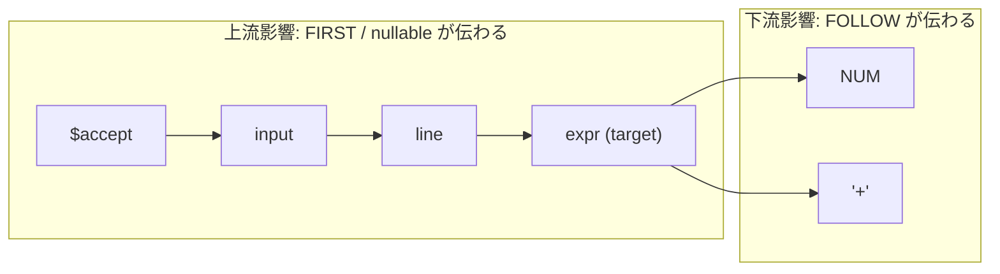

- **対象リポジトリ**: [ruby/lrama](https://github.com/ruby/lrama)
- **調査時点のリビジョン**: `1e9294d` (v0.8.0, master)

## 1. 概要

### 1.1 背景と課題

Lrama が対象とする文法ファイルは、CRuby の `parse.y` のように **2,000 規則規模** に達することがある。この規模では次の問題が起きる。

- ある非終端記号のルールを 1 行変えたとき、どの規則・どの状態・どのアクションが影響を受けるのか、人間には追えない。
- 変更してから `lrama` を実行し、conflict が増えて初めて影響に気づく。しかも conflict は変更箇所から遠い状態で顕在化することが多く、原因の特定に時間がかかる。
- レビュー時に「この変更の影響範囲はここまでです」と説明する客観的な材料がない。
- 既存の `--report`／`--trace`／`--diagram` は「文法全体の状態」を出力するもので、**「特定の記号を起点とした影響の伝播」** を問う手段が存在しない。

### 1.2 目的

非終端記号 `A` を指定すると、**`A` のルールを変更したときに影響が及びうる範囲**を静的に列挙する機能を Lrama に追加する。

具体的な提供物:

1. 影響解析のコアライブラリ `Lrama::Impact`
2. CLI オプション `--impact` 系
3. 機械可読な出力 (JSON / DOT) によるエディタ・CI 連携の土台

### 1.3 ゴール / 非ゴール

| | 内容 |
|---|---|
| ゴール | 記号・規則・状態・アクションの 4 レベルで影響範囲を列挙する |
| ゴール | 影響が **過小評価されない**（偽陰性を出さない）保守的近似を保証する |
| ゴール | 影響の伝播経路（なぜ影響するのか）を提示する |
| ゴール | `States#compute` を必要としない高速モードを用意し、エディタからの反復実行に耐える |
| ゴール | 既存の生成結果・既存オプションの挙動を一切変えない |
| 非ゴール | 意味アクション内の C コードの静的解析（型検査・データフロー解析） |
| 非ゴール | 「この変更で conflict が必ず増える／減る」の断定的な予測 |
| 非ゴール | テストコードやビルド成果物との紐付け（テスト影響範囲の特定） |
| 非ゴール | 文法の自動修正・リファクタリング支援 |

### 1.4 用語

| 用語 | 定義 |
|---|---|
| ターゲット記号 | 影響解析の起点としてユーザが指定する非終端記号 |
| 上流影響 (upstream) | ターゲットを RHS に含む規則の方向へ伝播する影響。`FIRST` / `nullable` が伝わる方向 |
| 下流影響 (downstream) | ターゲットの RHS に現れる記号の方向へ伝播する影響。`FOLLOW` が伝わる方向 |
| 影響レベル | 報告の粒度。`symbol` / `rule` / `state` / `action` |
| 正規化済み規則 | `Grammar#prepare` 実行後の `Grammar#rules`。inline 展開・midrule 分離・`$accept` 追加が済んだもの |
| 保守的近似 | 実際には影響しない箇所を含みうるが、影響する箇所を取りこぼさない解析結果 |

---

## 2. ユースケース

**UC-1: 変更前の影響見積り（対話利用）**

```console
$ lrama --impact=expr sample/calc.y
```

`expr` に規則を追加する前に、波及先を確認する。

**UC-2: レビュー時の影響範囲の提示（CI 利用）**

PR で変更された非終端記号を検出し、影響範囲を JSON で出力して PR コメントに貼る。

```console
$ lrama --impact=arg,args --impact-format=json --impact-file=impact.json parse.y
```

**UC-3: conflict の原因追跡**

conflict が出た状態 ID がわかっているとき、どの記号の変更がその状態に届きうるかを逆引きする。

**UC-4: 大規模文法の理解**

`parse.y` に新規参加した開発者が、`stmt` を起点に文法の依存構造を DOT で可視化する。

```console
$ lrama --impact=stmt --impact-format=dot parse.y | dot -Tsvg -o stmt.svg
```

**UC-5: 差分ベースの影響解析（Phase 4）**

変更前後の文法ファイルを比較し、実際に変わった記号を自動検出して影響を出す。

```console
$ git show HEAD:parse.y > /tmp/base.y
$ lrama --impact-diff=/tmp/base.y parse.y
```

---

## 3. 要件

### 3.1 機能要件

| ID | 要件 |
|---|---|
| FR-1 | 非終端記号を 1 個以上指定して影響解析を実行できる |
| FR-2 | ターゲットを RHS に含む規則を、ソース上の位置とともに列挙する |
| FR-3 | 推移的に影響を受ける非終端記号を、伝播経路つきで列挙する |
| FR-4 | `nullable` / `FIRST` / `FOLLOW` のどれが変化しうるかを記号ごとに区別する |
| FR-5 | 影響を受ける LR 状態を、影響理由（closure / goto / reduce）つきで列挙する |
| FR-6 | 影響状態に既存の conflict がある場合、リスクとして強調する |
| FR-7 | ターゲットを `$n` で参照している意味アクションを列挙する（`%type` 変更時の修正対象） |
| FR-8 | 伝播の深さを制限できる |
| FR-9 | text / JSON / DOT の 3 形式で出力できる |
| FR-10 | midrule action 由来の記号 (`$@1` 等) を既定で折り畳み、オプションで展開できる |
| FR-11 | parameterized rule (`%rule`) と `%inline` の変更を、生成された全インスタンスの変更として扱う |
| FR-12 | 未定義の記号名・終端記号を指定した場合、原因のわかるエラーを返す |

### 3.2 非機能要件

| ID | 要件 |
|---|---|
| NFR-1 | 偽陰性を出さない（保守的近似）。制約は §7.9 に明記する |
| NFR-2 | `symbol` / `rule` / `action` レベルは `States#compute` を行わずに完了する |
| NFR-3 | CRuby の `parse.y` 相当（規則数 2,000 超）で、`rule` レベルが 100ms 未満、`state` レベルが `States#compute` 込みで既存の `lrama -v` と同等以内 |
| NFR-4 | BASERUBY (Ruby 3.1) で動作し、default gems 以外に依存しない |
| NFR-5 | `rbs-inline` アノテーションを付与し、`rake steep` を通す |
| NFR-6 | `--impact` 未指定時、既存コードパスに一切の実行時オーバーヘッドを与えない |

---

## 4. 「影響」の定義

### 4.1 何が変わりうるか

非終端記号 `A` の規則集合を変更したとき、パーサ生成の各段階に次の影響が生じうる。

| 変更内容 | 影響する計算 | 伝播方向 | 検出レベル |
|---|---|---|---|
| `A` の規則の追加・削除・RHS 変更 | `nullable(A)` | 上流 | symbol |
| 同上 | `FIRST(A)` | 上流 | symbol |
| 同上 | `FOLLOW(X)` (`X` は `A` の RHS に出現) | 下流 | symbol |
| 同上 | LR(0) 状態の closure / goto | `A` を含む状態 | state |
| 同上 | LALR 先読み集合 (`la`) | Reads/Includes 関係の逆到達 | state |
| 同上 | shift/reduce・reduce/reduce conflict | 影響状態 | state |
| `A` の RHS 長の変更 | 同一規則内の `$1..$n` / named reference | 当該規則のみ | action |
| `A` の `%type` タグ変更 | `A` を `$n` で参照する全アクション、`%destructor` / `%printer` | 上流 | action |
| `A` の precedence 変更 | `A` を含む規則の既定 precedence | 上流 | rule |
| 規則の増減 | 規則番号 (`Rule#id`) の再採番 → 生成テーブル全体 | 全体 | （報告対象外） |

> **規則番号の再採番について**: 規則を 1 つ追加すれば以降の `Rule#id` がすべてずれ、生成される `yytable` 等はほぼ全域が変化する。しかしこれは「文法的な影響」ではなくエンコーディング上の差分にすぎないため、本機能の報告対象から除外する。ただし text 出力の末尾に注記を 1 行入れる。

### 4.2 影響レベルの定義

```text
symbol  影響を受ける記号（nullable / FIRST / FOLLOW の変化可能性）
  ↓ 含む
rule    影響を受ける規則（ターゲットまたは影響記号を LHS/RHS に持つ規則）
  ↓ 含む
action  影響を受ける意味アクション・型タグ
  ↓ 別軸
state   影響を受ける LR 状態・遷移・先読み・conflict
```

CLI の `--impact-level` は `symbol` < `rule` < `action` < `state` < `all` の包含順とし、上位を指定すると下位の情報も含む。既定は `rule`。

### 4.3 伝播方向の直感



`expr` の規則を変えると:

- **上流**: `expr` を使っている `line`、その先の `input`、`$accept` の `FIRST`/`nullable` が変わりうる。
- **下流**: `expr` の RHS に現れる `NUM` や `'+'` の `FOLLOW` が変わりうる。`expr: expr '+' expr` から `'+'` を消せば、`FOLLOW(expr)` から `'+'` が消えるかもしれない。

**両方向を報告することが本機能の要点**である。片方向（上流のみ）の解析はよくある実装だが、下流の `FOLLOW` 変化を見落とすと「なぜ関係ない場所で conflict が出たのか」に答えられない。

---

## 5. アーキテクチャ

### 5.1 既存ワークフローとの関係

現行の `Lrama::Command#execute_command_workflow`:

```ruby
def execute_command_workflow
  @tracer.enable_duration
  text = read_input
  grammar = build_grammar(text)            # Parser → prepare → validate!
  states, context = compute_status(grammar) # States#compute (+ ielr)
  render_reports(states) if @options.report_file
  @tracer.trace(grammar)
  render_diagram(grammar)
  render_output(context, grammar)          # C コード生成
  states.validate!(@logger)
  @warnings.warn(grammar, states)
end
```

影響解析は **`build_grammar` の直後に挿入**し、`--impact` 指定時は診断モードとしてパーサ生成をスキップする。

```ruby
def execute_command_workflow
  @tracer.enable_duration
  text = read_input
  grammar = build_grammar(text)

  if @options.impact_opts
    return run_impact_analysis(grammar)   # ← 追加。ここで return
  end

  states, context = compute_status(grammar)
  # ...以降は現行のまま
end

private

# @rbs (Lrama::Grammar grammar) -> void
def run_impact_analysis(grammar)
  opts   = @options.impact_opts
  states = need_states?(opts[:level]) ? compute_status(grammar).first : nil
  result = Lrama::Impact::Analyzer.new(grammar, states: states).analyze(
    opts[:targets], level: opts[:level], depth: opts[:depth],
    include_midrule: opts[:include_midrule]
  )
  Lrama::Impact::Reporter.new(**opts).report(impact_io, result)
rescue Lrama::Impact::Error => e
  abort format_error_message(e.message)
end

# @rbs (Symbol level) -> bool
def need_states?(level)
  %i[state all].include?(level)
end
```

**設計上の判断**: `--impact` を診断専用モードとする。

- 理由 1: エディタ・CI から反復実行されるため、`y.tab.c` を副作用として書き出すべきでない。
- 理由 2: `symbol`/`rule`/`action` レベルでは `States#compute` が不要で、実行時間が 1〜2 桁短縮される。
- 生成も同時に行いたい場合は `--impact-with-output` を将来追加できるが、初版では非対応とする。

### 5.2 モジュール構成

```text
lib/lrama/impact.rb                       # ファサード + require
lib/lrama/impact/analyzer.rb              # 解析のオーケストレーション
lib/lrama/impact/dependency_graph.rb      # 記号間依存グラフ
lib/lrama/impact/symbol_analysis.rb       # nullable / FIRST / FOLLOW 影響
lib/lrama/impact/rule_analysis.rb         # 規則レベル影響
lib/lrama/impact/state_analysis.rb        # 状態・先読み・conflict 影響
lib/lrama/impact/action_analysis.rb       # $n 参照 / %type / %destructor 影響
lib/lrama/impact/origin_resolver.rb       # 正規化済み規則 → 元ソース位置の逆写像
lib/lrama/impact/result.rb                # 解析結果の値オブジェクト
lib/lrama/impact/entry.rb                 # SymbolEntry / RuleEntry / StateEntry / ActionEntry
lib/lrama/impact/path.rb                  # 伝播経路
lib/lrama/impact/error.rb                 # Lrama::Impact::Error
lib/lrama/impact/reporter.rb              # 出力の振り分け
lib/lrama/impact/formatter/text.rb
lib/lrama/impact/formatter/json.rb
lib/lrama/impact/formatter/dot.rb
lib/lrama/impact/diff.rb                  # Phase 4: 差分モード
```

既存の `Lrama::Reporter` は `report(io, states)` というシグネチャで `States` 前提のため再利用せず、`Lrama::Impact::Reporter` を独立させる。ただし `Lrama::Tracer::Duration` は `include` して `--trace=time` と統合する。

### 5.3 既存コードへの変更点

| ファイル | 変更内容 | 規模 |
|---|---|---|
| `lib/lrama.rb` | `require_relative "lrama/impact"` を 1 行追加 | 1 行 |
| `lib/lrama/options.rb` | `attr_accessor :impact_opts` を追加 | 数行 |
| `lib/lrama/option_parser.rb` | `--impact*` オプション定義と `validate_impact` を追加 | 約 40 行 |
| `lib/lrama/command.rb` | `execute_command_workflow` に分岐、`run_impact_analysis` を追加 | 約 25 行 |
| `lib/lrama/grammar/inline/resolver.rb` | inline 展開元の対応表を記録（Phase 3 で必要、§7.8 参照） | 約 10 行 |
| `sig/generated/**` | `rake rbs_inline` により再生成 | 自動 |
| `doc/development/impact_analysis.md` | 本設計書のダイジェストを開発者向けドキュメントとして追加 | 新規 |

既存コードの**振る舞いを変える変更は無い**。`--impact` が未指定なら `@options.impact_opts` は `nil` で、分岐は即座に false になる。

---

## 6. データモデル

```ruby
# lib/lrama/impact/result.rb
module Lrama
  class Impact
    class Result
      attr_reader :targets          #: Array[Grammar::Symbol]
      attr_reader :level            #: Symbol
      attr_reader :symbols          #: Array[SymbolEntry]
      attr_reader :rules            #: Array[RuleEntry]
      attr_reader :actions          #: Array[ActionEntry]
      attr_reader :states           #: Array[StateEntry]
      attr_reader :conflict_risks   #: Array[ConflictRisk]
      attr_reader :notes            #: Array[String]  # 解析の限界に関する注記

      # @rbs () -> Hash[Symbol, Integer]
      def summary
        { symbols: @symbols.size, rules: @rules.size,
          actions: @actions.size, states: @states.size,
          conflict_risks: @conflict_risks.size }
      end
    end
  end
end
```

```ruby
# lib/lrama/impact/entry.rb
module Lrama
  class Impact
    # 影響を受ける記号
    SymbolEntry = Struct.new(
      :symbol,      #: Grammar::Symbol
      :direction,   #: Symbol  -- :upstream | :downstream | :both
      :changes,     #: Array[Symbol]  -- [:nullable, :first_set, :follow_set]
      :distance,    #: Integer  -- ターゲットからの最短ホップ数
      :path,        #: Path     -- 最短伝播経路
      keyword_init: true
    )

    # 影響を受ける規則
    RuleEntry = Struct.new(
      :rule,        #: Grammar::Rule
      :reason,      #: Symbol  -- :defines_target | :references_target
                    #             | :references_affected | :precedence
      :via,         #: Grammar::Symbol  -- 影響が届いた経路上の記号
      :location,    #: Lexer::Location?  -- 元ソース上の位置
      keyword_init: true
    )

    # 影響を受ける LR 状態
    StateEntry = Struct.new(
      :state,       #: Lrama::State
      :reasons,     #: Array[Symbol] -- [:closure, :goto, :kernel, :reduce, :lookahead]
      :items,       #: Array[State::Item]  -- 影響理由となったアイテム
      keyword_init: true
    )

    # 影響を受ける意味アクション / 型
    ActionEntry = Struct.new(
      :rule,        #: Grammar::Rule
      :references,  #: Array[Grammar::Reference]  -- $1, $$, @2 など
      :tag,         #: Lexer::Token::Tag?
      :kind,        #: Symbol -- :rule_action | :destructor | :printer | :type
      :location,    #: Lexer::Location?
      keyword_init: true
    )

    # conflict リスク
    ConflictRisk = Struct.new(
      :state,       #: Lrama::State
      :kind,        #: Symbol -- :existing | :potential
      :detail,      #: String
      keyword_init: true
    )
  end
end
```

```ruby
# lib/lrama/impact/path.rb
# ターゲットから当該記号までの伝播経路を保持する。
# 例: line <- expr は Path[line, expr]（左が影響先、右がターゲット）
class Path
  attr_reader :symbols  #: Array[Grammar::Symbol]
  attr_reader :edges    #: Array[Grammar::Rule]  -- 各ホップの根拠となった規則

  # @rbs () -> String
  def display_name
    @symbols.map { |s| s.id.s_value }.join(" <- ")
  end
end
```

---

## 7. アルゴリズム

### 7.1 依存グラフの構築

正規化済み規則 `Grammar#rules` から双方向インデックスを 1 パスで構築する。

```ruby
# lib/lrama/impact/dependency_graph.rb
class DependencyGraph
  # @rbs (Lrama::Grammar grammar) -> void
  def initialize(grammar)
    @grammar   = grammar
    @used_by   = Hash.new { |h, k| h[k] = [] }  # sym.number => Array[Rule]  (sym を RHS に含む規則)
    @defines   = Hash.new { |h, k| h[k] = [] }  # sym.number => Array[Rule]  (sym を LHS とする規則)
    build
  end

  private

  # @rbs () -> void
  def build
    @grammar.rules.each do |rule|
      @defines[rule.lhs.number] << rule
      rule.rhs.uniq(&:number).each { |sym| @used_by[sym.number] << rule }
    end
  end
end
```

- `@defines` は既存の `Grammar#sym_to_rules` と等価なので、実装ではそちらを再利用してよい（`Grammar#find_rules_by_symbol`）。
- `@used_by` が本機能の中核であり、既存コードには存在しない。
- 計算量 `O(Σ|rhs|)`、追加メモリ `O(Σ|rhs|)`。

### 7.2 上流影響（記号レベル）

ターゲット集合 `T` から `used_by` を辿る幅優先探索。

```text
worklist ← T
visited  ← T
while worklist が空でない:
    A ← worklist.shift
    for rule in used_by[A]:
        B ← rule.lhs
        if B ∉ visited:
            visited ← visited ∪ {B}
            path[B] ← path[A] に B を前置
            worklist.push(B)
```

- 訪問済みチェックにより再帰・相互再帰でも停止する。
- `distance` は BFS の層で、`path` は最短経路になる。
- 計算量 `O(|N| + Σ|rhs|)`。

### 7.3 `nullable` の変化の伝播

`nullable` は「RHS の全記号が nullable なら LHS も nullable」という最小不動点である（`Grammar#compute_nullable`）。ターゲット `A` の `nullable` が変わったと仮定して、変化しうる記号だけをワークリストで求める。

```text
Δ_nullable ← T
worklist   ← T
while worklist が空でない:
    A ← worklist.shift
    for rule in used_by[A]:
        # rule.rhs から A を除いた残りが全て nullable なら、
        # nullable(A) の変化が nullable(rule.lhs) に伝わりうる
        rest ← rule.rhs から A の出現を除いたもの
        if rest.all?(&:nullable) かつ rule.lhs ∉ Δ_nullable:
            Δ_nullable ← Δ_nullable ∪ {rule.lhs}
            worklist.push(rule.lhs)
```

上流影響 (§7.2) の部分集合になる。`Symbol#nullable` は `prepare` 済みなら参照可能。

### 7.4 `FIRST` の変化の伝播

`FIRST` の定義（`Grammar#compute_first_set`）より、`B → X₁ … Xₙ` で `Xᵢ = A` かつ `X₁ … Xᵢ₋₁` が全て nullable のとき `FIRST(B) ⊇ FIRST(A)`。

```text
Δ_first  ← T
worklist ← T
while worklist が空でない:
    A ← worklist.shift
    for rule in used_by[A]:
        for (i, sym) in rule.rhs.each_with_index:
            next unless sym == A
            next unless rule.rhs[0...i].all? { |s| s.nullable || s ∈ Δ_nullable }
            if rule.lhs ∉ Δ_first:
                Δ_first ← Δ_first ∪ {rule.lhs}
                worklist.push(rule.lhs)
            break
```

**`Δ_nullable` を先に計算し、その結果を prefix 判定に使う**点が重要。`nullable` が変わりうる記号を nullable とみなすことで、保守的側（安全側）に倒す。

### 7.5 `FOLLOW` / 先読み集合への影響（下流）

`A` の規則が変われば、`A` の RHS に現れる記号の `FOLLOW` が変わる。

```text
直接: D₀ = { rule.rhs の全記号 | rule ∈ defines[A] } ∪ T
伝播: FOLLOW(X) は FIRST(後続) と FOLLOW(LHS) から決まるため、
      D₀ の各記号について
        - その FIRST が変わりうる記号（Δ_first ∩ 下流到達集合）
        - defines[X] の RHS 末尾に現れる記号（FOLLOW(X) ⊆ FOLLOW(末尾記号)）
      を再帰的に追加する。
```

`state` レベルでは、より精密に **DeRemer & Pennello の関係グラフ**を直接使える。Lrama は `Lrama::States` に以下を保持している。

```ruby
states.reads_relation     #=> Hash[State::Action::Goto, Array[State::Action::Goto]]
states.includes_relation  #=> Hash[State::Action::Goto, Array[State::Action::Goto]]
states.lookback_relation  #=> Hash[state_id, Hash[rule_id, Array[State::Action::Goto]]]
```

手順:

1. ターゲット `A` に関係する goto 集合 `G₀` を求める。
   `G₀ = { (q, A) | q ∈ states, q.transition(A) が存在 } ∪ { (q, X) | X ∈ A の RHS の非終端記号 }`
2. `reads_relation` と `includes_relation` の **逆グラフ**上で `G₀` から到達可能な goto 集合 `G*` を求める。
   `Follow(p, B)` は `Reads`/`Includes` で辿れる先の集合の和で定義されるため、逆向きに辿ったものが「影響を受ける goto」になる。
3. `lookback_relation` を使って `G*` に依存する `(state_id, rule_id)` を求める。これが **先読み集合が変わりうる reduce** である。
4. 3 で得られた reduce を持つ状態を、`reasons: [:lookahead]` として `StateEntry` に加える。

既存の `Lrama::Digraph` クラスは不動点計算用だが、ここで必要なのは単純な逆到達可能性なので BFS で十分。

### 7.6 状態レベルの影響

記号集合 `Δ = T ∪ Δ_first ∪ Δ_nullable ∪ Δ_follow` に対し、全状態を 1 パス走査する。

```ruby
# lib/lrama/impact/state_analysis.rb
# @rbs (Set[Integer] affected_numbers) -> Array[StateEntry]
def analyze(affected_numbers)
  @states.states.filter_map do |state|
    reasons = []
    items   = []

    reasons << :kernel if state.kernels.any? { |i| affected_numbers.include?(i.rule.lhs.number) }
    reasons << :goto   if state.nterm_transitions.any? { |t| affected_numbers.include?(t.next_sym.number) }

    state.items.each do |item|
      # ドットの直後に影響記号 → closure が変わる
      if item.next_sym && affected_numbers.include?(item.next_sym.number)
        reasons << :closure
        items << item
      end
      # 影響記号の規則が展開されている
      if affected_numbers.include?(item.rule.lhs.number)
        reasons << :closure
        items << item
      end
    end

    reasons << :reduce if state.reduces.any? { |r| affected_numbers.include?(r.rule.lhs.number) }

    next nil if reasons.empty?
    StateEntry.new(state: state, reasons: reasons.uniq, items: items.uniq)
  end
end
```

計算量は全アイテム数に線形 `O(|I|)`。

### 7.7 アクション・型への影響

`Lexer::Token::UserCode#references` から `$n` / `$$` / `@n` の参照が取得できる（`Grammar::Reference`）。

```text
for rule in used_by[A]:
    next unless rule.token_code
    positions ← rule.rhs 中で A が現れる添字の集合（1-origin）
    refs ← rule.token_code.references.select { |r| r.type == :dollar && positions.include?(r.index) }
    次を ActionEntry として報告:
      - refs が非空 → :rule_action（`%type` 変更時に修正が必要な箇所）
```

さらに:

- `A` の `%type` タグ `t` について、同じタグを持つ記号の `%destructor` / `%printer` を `kind: :destructor` / `:printer` として列挙する（`Grammar#printers`, `Symbol#destructor`）。
- `A` の RHS 長を変える変更は `defines[A]` の各規則自身の `$1..$n` を壊すため、`defines[A]` のアクションも `kind: :rule_action` で列挙する。
- named reference (`expr[lhs]`) も `Reference#name` で同様に扱う。

### 7.8 parameterized rule / `%inline` / midrule action の扱い

これが Lrama 固有の最大の難所である。影響解析は `Grammar#prepare` 後の**正規化済み規則**に対して行うが、ユーザが編集するのは**元の `.y` ソース**である。両者を対応づける必要がある。

| 構文 | prepare 後の姿 | 対応方針 |
|---|---|---|
| midrule action | `$@1` などの新しい非終端記号 (`Symbol#midrule?` が true) | 既定では親規則に折り畳んで報告。`--impact-include-midrule` で展開表示 |
| `%inline foo` | 呼び出し元の RHS に展開され、`foo` は最終的な規則集合に残らない | 展開元の対応表が必要（下記） |
| `%rule opt(X)` | `opt_expr`, `opt_stmt` のように実体化された記号群が生成される | `Parameterized::Resolver#created_lhs_list` から「テンプレート名 → 生成記号」を引き、テンプレート名指定時は全インスタンスをターゲットに展開 |
| stdlib (`option`, `list` 等) | 同上 | 同上。ただし既定では `--impact` の対象外（`--impact-include-stdlib` で有効化） |

**`%inline` への対応に必要な既存コード変更**:

`Grammar::Inline::Resolver#resolve` は展開後の `RuleBuilder` を返すが、「どの inline 記号がどこに展開されたか」を保持していない。次を追加する。

```ruby
# lib/lrama/grammar/inline/resolver.rb
attr_reader :expansions  #: Hash[String, Array[Lexer::Location]]
#   inline 記号の s_value => 展開された箇所の位置
```

これにより、`--impact=some_inline_rule` に対して「この inline 規則は N 箇所に展開されており、その全てが影響を受ける」と報告できる。

**元ソース位置への逆写像** (`OriginResolver`):

```ruby
# @rbs (Grammar::Rule rule) -> Lexer::Location?
def source_location(rule)
  r = rule.original_rule || rule
  r._lhs&.location || location_from_lineno(r.lineno)
end
```

`Rule#original_rule` と `Rule#lineno`、`Lexer::Token::Base#location` を使う。midrule 由来の規則は `original_rule` を辿って親規則の位置に解決する。

### 7.9 保守的近似の保証と、その限界

**保証すること（偽陰性なし）**

現行の文法に既に存在する記号・規則に関しては、`A` の規則を「削除する」「RHS の記号の順序を変える」「既存の記号を使った代替規則を追加する」といった変更で影響を受ける箇所は、すべて出力に含まれる。上流・下流の両方向を推移閉包で辿り、`nullable` の変化を安全側に丸めているためである。

**保証しないこと（明示すべき限界）**

1. **新しい記号の導入**: `A: NEW_TOKEN foo` のように、現行文法に存在しない記号を `A` の RHS に追加する変更は、その新記号を経由した依存を予測できない。→ text 出力の `Notes` に明記し、`--impact-diff`（Phase 4）の利用を推奨する。
2. **精度（偽陽性）**: 記号レベルの推移閉包は容易に `$accept` まで到達するため、大規模文法では「影響記号」が広くなりがち。これは `--impact-depth` による深さ制限と、`changes` フィールドによる `nullable`/`FIRST`/`FOLLOW` の区別で緩和する。「全記号が上流影響」でも「`FIRST` が変わりうるのは 3 個だけ」といった絞り込みが効く。
3. **conflict の増減**: 「影響状態に既存 conflict がある」「影響状態の reduce の先読みが変わりうる」までは言えるが、変更後に conflict が増えるか減るかは断定できない。`ConflictRisk#kind` を `:existing` / `:potential` に分けて、断定を避けた表現で出力する。

### 7.10 計算量まとめ

| 処理 | 計算量 | `States#compute` 必要 |
|---|---|---|
| 依存グラフ構築 | `O(Σ\|rhs\|)` | 不要 |
| 上流/下流到達可能性 | `O(\|N\| + Σ\|rhs\|)` | 不要 |
| `nullable` / `FIRST` 伝播 | `O(Σ\|rhs\|)` | 不要 |
| アクション解析 | `O(Σ\|references\|)` | 不要 |
| 状態走査 | `O(\|I\|)` (総アイテム数) | **必要** |
| goto 逆到達 | `O(\|G\| + \|Reads\| + \|Includes\|)` | **必要** |

`symbol` / `rule` / `action` レベルは文法サイズに対して実質線形で、`States#compute` を回避できるため、`parse.y` 規模でも 100ms 以下を狙える。`state` レベルのコストは支配的に `States#compute` である。

---

## 8. CLI 設計

### 8.1 オプション

既存の `--report` / `--trace` / `--profile` のスタイル（カンマ区切り、`o.on_tail` での説明列挙）に合わせる。

```text
Impact Analysis:
    --impact=SYMBOLS             analyze the impact of changing rules of SYMBOLS
    --impact-level=LEVEL         limit the analysis level (default: rule)
    --impact-format=FORMAT       output format: text, json, dot (default: text)
    --impact-depth=N             limit propagation depth (default: unlimited)
    --impact-file=FILE           write the impact report to FILE (default: STDOUT)
    --impact-include-midrule     do not fold midrule action symbols
    --impact-include-stdlib      include rules instantiated from stdlib
    --impact-diff=FILE           compare the grammar with the one in FILE

LEVEL is one of:
    symbol                       affected symbols only (fastest)
    rule                         affected rules (default)
    action                       affected semantic actions and type tags
    state                        affected LR states, lookaheads and conflicts
    all                          include all the above
```

`Options` への追加:

```ruby
# lib/lrama/options.rb
attr_accessor :impact_opts #: Hash[Symbol, untyped]?
#   { targets: Array[String], level: Symbol, format: Symbol,
#     depth: Integer?, file: String?, include_midrule: bool,
#     include_stdlib: bool, diff: String? }
```

`OptionParser` への追加:

```ruby
VALID_IMPACT_LEVELS  = %w[symbol rule action state all].freeze
VALID_IMPACT_FORMATS = %w[text json dot].freeze

# @rbs (Array[String] targets) -> Hash[Symbol, untyped]?
def validate_impact(targets)
  return nil if targets.empty? && @impact_diff.nil?

  unless VALID_IMPACT_LEVELS.include?(@impact_level)
    raise "Invalid impact level \"#{@impact_level}\".\n" \
          "Valid levels are [#{VALID_IMPACT_LEVELS.join(', ')}]."
  end
  unless VALID_IMPACT_FORMATS.include?(@impact_format)
    raise "Invalid impact format \"#{@impact_format}\".\n" \
          "Valid formats are [#{VALID_IMPACT_FORMATS.join(', ')}]."
  end
  { targets: targets, level: @impact_level.to_sym, format: @impact_format.to_sym, ... }
end
```

### 8.2 エラーハンドリング

| 状況 | 挙動 |
|---|---|
| 指定した記号が存在しない | `Unknown symbol "expre". Did you mean "expr"?`（レーベンシュタイン距離で候補提示）、終了コード 1 |
| 指定した記号が終端記号 | `"NUM" is a terminal symbol. Impact analysis targets nonterminal symbols.` 終了コード 1 |
| 指定した記号が `%rule` テンプレート | 生成された全インスタンスに展開し、その旨を Notes に出力 |
| ターゲットがどこからも参照されていない | 正常終了。「影響なし（この記号は未使用の可能性があります）」と出力し、`--report=rules` の併用を案内 |
| `--impact` と `-o` の同時指定 | `-o` は無視される旨を警告し、解析のみ実行 |

### 8.3 終了コード

| コード | 意味 |
|---|---|
| 0 | 解析成功 |
| 1 | オプション不正・記号未検出・文法エラー |

CI で「影響が閾値を超えたら落とす」といった判定は、JSON 出力を外部ツールで処理する方式とし、Lrama 側では終了コードに影響範囲を反映しない（`--report` 等の既存挙動と一貫させる）。

---

## 9. 出力仕様

### 9.1 text 形式

```console
$ lrama --impact=expr --impact-level=all sample/calc.y

Impact of changing rules of `expr`

Target
  expr                                     nterm, sample/calc.y:42
    defined by 5 rules (#12-#16)

Affected Rules (4)
  referencing target:
    #7   line: expr '\n'                   sample/calc.y:31
    #12  expr: expr '+' expr               sample/calc.y:42
    #13  expr: expr '-' expr               sample/calc.y:43
    #14  expr: expr '*' expr               sample/calc.y:44

Affected Symbols (upstream, 3)
  line                 <- expr             first_set             sample/calc.y:31
  input                <- line <- expr     first_set, nullable   sample/calc.y:27
  $accept              <- input <- line <- expr
                                           first_set

Affected Symbols (downstream, 4)
  NUM                                      follow_set
  '+'                                      follow_set
  '-'                                      follow_set
  '*'                                      follow_set

Affected Actions (5)
  #7   sample/calc.y:31   $1        <val>  rule_action
  #12  sample/calc.y:42   $1, $3    <val>  rule_action
  ...
  %printer <val>          sample/calc.y:18 printer

Affected States (18 of 24)
  State 5    accessing: expr      closure, goto, lookahead     1 shift/reduce conflict
  State 11   accessing: '+'       closure
  State 18   accessing: expr      kernel, reduce
  ...

Conflict Risks (1)
  existing   State 5   shift/reduce conflict on '+'
             This state is directly affected; the conflict may change.

Notes
  - This analysis assumes the change reuses symbols that already exist in the
    grammar. Introducing a brand-new symbol may affect additional places.
  - Rule renumbering caused by adding/removing rules is not reported.
  - Midrule action symbols are folded into their parent rules
    (use --impact-include-midrule to expand).
```

**表示方針**

- 既存の `.output` レポートの列揃えスタイル（`sprintf("%5d %s", ...)`）に寄せる。
- 影響記号は必ず「経路」と「変わりうる計算の種類」を併記する。理由を示さない一覧は使い物にならない。
- 件数が多い場合は既定で上位 50 件に丸め、`... and N more` を出す（`--impact-file` 指定時は全件出力）。

### 9.2 JSON 形式

```json
{
  "schema_version": 1,
  "lrama_version": "0.8.0",
  "grammar_file": "sample/calc.y",
  "level": "all",
  "targets": [
    { "name": "expr", "location": { "file": "sample/calc.y", "line": 42, "column": 0 },
      "rule_ids": [12, 13, 14, 15, 16] }
  ],
  "affected": {
    "symbols": [
      { "name": "line", "direction": "upstream", "distance": 1,
        "path": ["line", "expr"], "changes": ["first_set"],
        "location": { "file": "sample/calc.y", "line": 31 } }
    ],
    "rules": [
      { "id": 7, "lhs": "line", "rhs": ["expr", "'\\n'"],
        "display_name": "line -> expr '\\n'",
        "reason": "references_target", "via": "expr",
        "location": { "file": "sample/calc.y", "line": 31 } }
    ],
    "actions": [
      { "rule_id": 12, "kind": "rule_action", "references": ["$1", "$3"],
        "tag": "val", "location": { "file": "sample/calc.y", "line": 42 } }
    ],
    "states": [
      { "id": 5, "accessing_symbol": "expr",
        "reasons": ["closure", "goto", "lookahead"],
        "conflicts": { "shift_reduce": 1, "reduce_reduce": 0 } }
    ],
    "conflict_risks": [
      { "state_id": 5, "kind": "existing",
        "detail": "shift/reduce conflict on '+'" }
    ]
  },
  "summary": { "symbols": 7, "rules": 4, "actions": 5, "states": 18,
               "conflict_risks": 1, "total_states": 24 },
  "notes": ["..."]
}
```

`schema_version` を先頭に置き、下位互換の判定を可能にする。JSON 生成は default gem の `json` のみを使う（NFR-4）。

### 9.3 DOT 形式

```text
digraph impact {
  rankdir = LR;
  node [shape = box, fontname = "monospace"];

  "expr"    [style = filled, fillcolor = "#ffd966", label = "expr\n(target)"];
  "line"    [label = "line\nfirst_set"];
  "input"   [label = "input\nfirst_set, nullable"];
  "$accept" [label = "$accept\nfirst_set"];
  "NUM"     [shape = ellipse, label = "NUM\nfollow_set"];

  "line"    -> "expr"  [label = "#7"];
  "input"   -> "line"  [label = "#3"];
  "$accept" -> "input" [label = "#0"];
  "expr"    -> "NUM"   [style = dashed, color = "#888888", label = "downstream"];
}
```

- 上流エッジは実線、下流エッジは破線で区別する。
- 終端記号は楕円、非終端記号は矩形。
- 既存の `--diagram`（railroad_diagrams、optional dependency）とは独立させ、DOT 出力は追加 gem 不要とする。

---

## 10. 差分モード（Phase 4）

`--impact-diff=BASE_FILE` で、変更された非終端記号を自動検出する。

### 10.1 手順

1. `BASE_FILE` と対象ファイルの両方を `Parser#parse` → `prepare` する。
2. 各規則について**安定署名**を計算する。
   ```
   signature(rule) = [ normalize(lhs.name),
                       rule.rhs.map { |s| normalize(s.name) },
                       rule.token_code&.s_value&.hash ]
   ```
   `normalize` は midrule 記号名 (`$@1`, `@2`) を「親規則名 + RHS 内位置」に置き換える。連番はわずかな編集でずれるため、そのままでは差分がノイズだらけになる。
3. 署名の多重集合を比較し、`added` / `removed` の規則集合を得る。
4. `changed_symbols = (added ∪ removed).map(&:lhs).uniq` を求める。
5. `changed_symbols` をターゲットとして通常の影響解析を実行する。
6. `--impact-level=state` 以上の場合、新旧それぞれで `States#compute` を実行し、次を差分表示する。
   - 状態数の増減
   - conflict の増減（状態 ID 単位。ID はずれるため、accessing symbol と kernel item の署名でマッチングする）

### 10.2 差分モードの意義

§7.9 で述べた「新しい記号の導入は静的解析では追えない」という限界を、差分モードは原理的に解消する。両方の文法が手元にあるため、新記号も含めた実際の依存関係を計算できる。

そのため、**CI での利用は差分モードを推奨**とし、ドキュメントでもそう案内する。

### 10.3 出力例

```console
$ lrama --impact-diff=/tmp/base.y parse.y

Grammar Diff
  rules added:    3
  rules removed:  1
  symbols changed: 2 (arg, args)
  symbols added:   1 (arg_splat)

Impact of the change
  affected rules:    47
  affected symbols:  12 (upstream: 9, downstream: 3)
  affected states:   233 of 1,412

State Diff
  total states:   1,405 -> 1,412  (+7)
  shift/reduce:      98 -> 101    (+3)
  reduce/reduce:      0 -> 0      (0)

New conflicts (3)
  State 812  shift/reduce on tSTAR    (kernel: arg -> arg . '*' arg)
  ...
```

---

## 11. 実装計画

| Phase | 内容 | 主なファイル | 依存 |
|---|---|---|---|
| **1** | 依存グラフ + 記号/規則レベル解析 + text 出力 + `--impact` / `--impact-level` / `--impact-depth` | `impact.rb`, `dependency_graph.rb`, `symbol_analysis.rb`, `rule_analysis.rb`, `formatter/text.rb`, `option_parser.rb`, `command.rb` | なし |
| **2** | アクション/型レベル解析、JSON / DOT 出力、`OriginResolver` | `action_analysis.rb`, `origin_resolver.rb`, `formatter/json.rb`, `formatter/dot.rb` | Phase 1 |
| **3** | 状態レベル解析、goto 逆到達による先読み影響、conflict リスク、`%inline` 対応 | `state_analysis.rb`, `grammar/inline/resolver.rb` の小改修 | Phase 1 |
| **4** | 差分モード | `diff.rb` | Phase 1-3 |
| **5** | エディタ連携（LSP サーバ or `--impact-format=json` を利用する外部ツール） | 別リポジトリを想定 | Phase 4 |

Phase 1 だけでも UC-1・UC-4 は満たせるため、単独で PR として成立する。**Phase ごとに独立した PR に分ける**ことを推奨する。

---

## 12. テスト計画

### 12.1 ディレクトリ構成

既存の慣習（`spec/lrama/**`, `spec/fixtures/**`）に合わせる。

```text
spec/lrama/impact/dependency_graph_spec.rb
spec/lrama/impact/analyzer_spec.rb
spec/lrama/impact/symbol_analysis_spec.rb
spec/lrama/impact/state_analysis_spec.rb
spec/lrama/impact/action_analysis_spec.rb
spec/lrama/impact/formatter/text_spec.rb
spec/lrama/impact/formatter/json_spec.rb
spec/lrama/impact/diff_spec.rb
spec/fixtures/impact/simple_chain.y
spec/fixtures/impact/recursive.y
spec/fixtures/impact/mutual_recursion.y
spec/fixtures/impact/nullable.y
spec/fixtures/impact/unreachable.y
spec/fixtures/impact/midrule.y
spec/fixtures/impact/parameterized.y
spec/fixtures/impact/inline.y
spec/fixtures/impact/diff_base.y
spec/fixtures/impact/diff_head.y
```

### 12.2 テストケース

| ID | ケース | 期待 |
|---|---|---|
| T-1 | 単純連鎖 `s: a; a: b; b: 'x'` で `b` を指定 | 上流に `a`, `s`, `$accept` が距離 1,2,3 で並ぶ |
| T-2 | 自己再帰 `expr: expr '+' expr` | 無限ループせず、`expr` が二重計上されない |
| T-3 | 相互再帰 `a: b; b: a \| 'x'` | 両方が 1 回ずつ列挙され停止する |
| T-4 | nullable な prefix `s: opt a; opt: %empty` で `a` を指定 | `s` の `first_set` が影響ありと判定される |
| T-5 | 非 nullable な prefix `s: 'x' a` で `a` を指定 | `s` の `first_set` は影響なし、`follow_set` のみ |
| T-6 | 到達不能な記号 | 影響対象に含まれない |
| T-7 | 未使用の非終端記号を指定 | 影響 0 件で正常終了し、案内メッセージが出る |
| T-8 | 終端記号を指定 | 専用のエラーメッセージ、終了コード 1 |
| T-9 | 存在しない記号を指定 | 候補提示つきエラー |
| T-10 | `--impact-depth=1` | 距離 1 の記号のみ |
| T-11 | midrule action を含む文法 | 既定で `$@1` が親規則に折り畳まれる |
| T-12 | `--impact-include-midrule` | `$@1` が独立して列挙される |
| T-13 | `%rule` テンプレートを指定 | 全インスタンスに展開される |
| T-14 | `%inline` 規則を指定 | 展開先が全て列挙される |
| T-15 | 下流影響 | `expr` 指定時に RHS の終端記号が `follow_set` として出る |
| T-16 | 状態レベル | `sample/calc.y` の `expr` で期待する状態 ID 集合と一致 |
| T-17 | conflict リスク | conflict を持つ状態が影響対象に含まれるとリスクとして出る |
| T-18 | JSON スキーマ | 必須キーが全て存在し、`schema_version` が 1 |
| T-19 | DOT 出力 | `digraph` として構文的に妥当（簡易パースで検証） |
| T-20 | 差分モード | 規則追加を検出し、`changed_symbols` が期待通り |
| T-21 | 既存挙動の非退行 | `--impact` 未指定時、`y.tab.c` の出力が従来と bit 単位で一致 |

### 12.3 統合テスト

`spec/lrama/integration_spec.rb` に、`sample/calc.y` と `sample/parse.y` に対する end-to-end のケースを追加する。特に **T-21（非退行）** は必須で、`--impact` 追加によって既存の生成結果が変わらないことを保証する。

### 12.4 型検査

全新規ファイルに `# rbs_inline: enabled` と `# frozen_string_literal: true` を付け、`rake rbs_inline` で `sig/generated/` を再生成し、`rake steep` を通す。既存コードと同じ規約に従う。

---

## 13. 後方互換性とリスク

| リスク | 影響度 | 対策 |
|---|---|---|
| CRuby ビルドへの影響 | 高 | `--impact` 未指定時は既存コードパスに一切触れない設計とし、T-21 で生成物の bit 単位一致を検証する |
| BASERUBY (3.1) 非互換 | 中 | `Set`・`json` は default gem。パターンマッチ等 3.2 以降の構文を使わない。CI に 3.1 マトリクスがあることを確認済み |
| 起動時間の増加 | 低 | `lib/lrama/impact/**` は `lib/lrama.rb` から eager に require されるが、クラス定義のみで初期化処理を持たない。気になる場合は `--impact` 指定時のみ `require` する遅延ロードに切り替える |
| 偽陽性による信頼低下 | 中 | `changes` フィールドと `--impact-depth` で絞り込みを提供し、Notes で解析の性質を明示する |
| `%inline` resolver の改修 | 中 | Phase 3 に切り出し、Phase 1-2 は既存コードに手を入れずに実装する |
| 出力仕様の将来変更 | 低 | JSON に `schema_version` を持たせ、text 出力は「人間向けで安定性を保証しない」と文書化する |

---

## 14. 将来拡張

1. **LSP 連携**: 文法ファイル上でカーソル位置の非終端記号に対し、影響範囲をエディタでハイライトする。`--impact-format=json` がそのまま入力になる。
2. **conflict の因果追跡**: `Lrama::Counterexamples` と統合し、「この conflict は記号 X の変更で生じた」を counterexample つきで示す。
3. **逆引きモード** (`--impact-of-state=5`): 状態 ID を起点に、どの記号を変えればその状態に影響するかを逆算する。UC-3 の直接的な支援になる。
4. **影響の重み付け**: 影響状態数・影響規則数を「変更コスト指標」として数値化し、リファクタリングの優先順位づけに使う。
5. **`--diagram` との統合**: railroad diagram 上で影響範囲を色分けする。

---

## 15. 未決事項

| # | 論点 | 選択肢 | 暫定案 |
|---|---|---|---|
| 1 | `--impact` を診断専用モードにするか、生成と併用するか | (a) 専用 (b) 併用 (c) `--impact-with-output` で選択 | (a)。将来 (c) を追加可能 |
| 2 | 出力先の既定 | (a) STDOUT (b) `.impact` ファイル（`--report` に倣う） | (a)。パイプ利用が主目的のため |
| 3 | `--impact-level` の既定値 | `symbol` / `rule` / `all` | `rule`。最も直感的な問い（どの規則を直すか）に答えるため |
| 4 | stdlib 由来の規則を既定で含めるか | 含める / 含めない | 含めない。`option(X)` 等がノイズになるため |
| 5 | 上流影響の既定深さ | 無制限 / 3 | 無制限。ただし text 出力では距離順にソートし上位から表示 |
| 6 | `Lrama::Impact` を class にするか module にするか | class（`Reporter` と同様） / module | class。既存の `Reporter` / `Warnings` / `Tracer` の慣習に合わせる |
| 7 | 差分モードで新旧 `States#compute` を 2 回回すコスト | 常時 / `--impact-level=state` のときのみ | 後者 |

---

## 付録 A: 主要な既存 API（実装時の参照先）

| 用途 | API |
|---|---|
| 正規化済み規則一覧 | `Grammar#rules` → `Array[Grammar::Rule]` |
| LHS から規則を引く | `Grammar#find_rules_by_symbol(sym)` / `Grammar#sym_to_rules` |
| 記号一覧 | `Grammar#symbols` / `#nterms` / `#terms` |
| 記号を名前で引く | `Grammar#find_symbol_by_s_value!(s_value)` |
| 規則の LHS / RHS | `Rule#lhs` / `Rule#rhs` → `Grammar::Symbol` |
| 規則の表示名 | `Rule#display_name` / `#as_comment` |
| 規則の元の姿 | `Rule#original_rule`, `Rule#lineno`, `Rule#_lhs` |
| nullable / FIRST | `Symbol#nullable`, `Symbol#first_set`, `Symbol#first_set_bitmap` |
| midrule 判定 | `Symbol#midrule?` |
| 意味アクション | `Rule#token_code` → `Lexer::Token::UserCode#references` |
| 型タグ | `Symbol#tag`, `Rule#lhs_tag`, `Grammar#types` |
| ソース位置 | `Lexer::Token::Base#location` → `Lexer::Location#first_line` 他 |
| 状態一覧 | `States#states` → `Array[State]` |
| 状態のアイテム | `State#items` (closure 含む) / `#kernels` |
| アイテムのドット直後 | `State::Item#next_sym` |
| 遷移 | `State#transitions` / `#nterm_transitions` / `#transition(sym)` |
| 還元 | `State#reduces` → `State::Action::Reduce` |
| conflict | `State#conflicts` / `#has_conflicts?` / `#sr_conflicts` / `#rr_conflicts` |
| 先読み関係 | `States#reads_relation` / `#includes_relation` / `#lookback_relation` / `#la` |
| parameterized | `Grammar#parameterized_resolver` → `Parameterized::Resolver#created_lhs_list` |
| 実行時間計測 | `Lrama::Tracer::Duration#report_duration` |

## 付録 B: 参考文献

- F. DeRemer, T. Pennello, "Efficient Computation of LALR(1) Look-Ahead Sets", *TOPLAS* 4(4), 1982.
  （`States#compute_look_ahead_sets` の Reads / Includes / Lookback 関係の出典。§7.5 の逆到達可能性はこの関係定義に基づく）
- Lrama `doc/development/` 以下の既存ドキュメント
